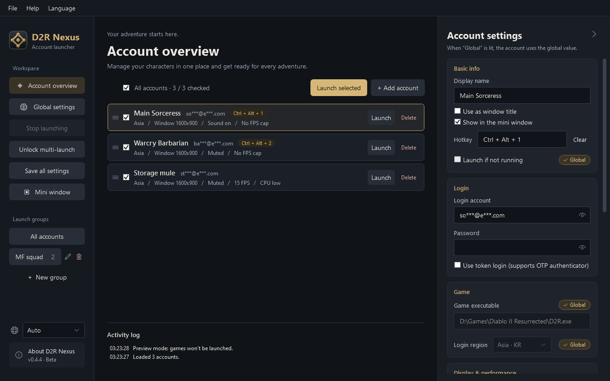
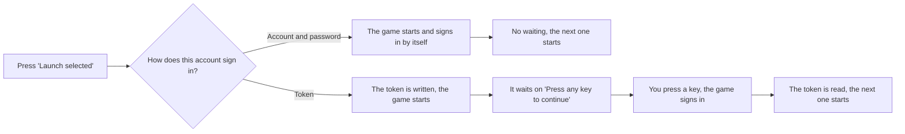
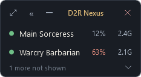

  

<h1 align="center">D2R Nexus</h1>

A multi-account launcher and manager for Diablo II: Resurrected (Windows)

<a href="README.md">繁體中文</a> · <a href="README.zh-CN.md">简体中文</a> · <b>English</b> · <a href="README.ko.md">한국어</a>

  
  

Check the accounts you want to play and click "Launch selected". Nexus opens each game for you, one after another, and unlocks the multi-launch limit automatically. Accounts with a phone authenticator (OTP) work too.

> Nexus is currently a beta. Some situations are still being tested on real setups.

## ✨ Features

**Multi-launch and login**

- **One-click multi-launch** — check your accounts and they open one by one in the order you set, with the multi-launch limit unlocked automatically
- **OTP authenticator support** — approve once on your phone, then launch directly from then on
- **Groups** — check the accounts you often play together with one click

**Each account can have its own settings**

- **Login region, windowed mode, mute, MOD, extra launch options**
- **Display & performance** — window size, frame cap, CPU priority. Lock background accounts to a low frame rate and set their priority low to leave resources for your main account
- **Window renaming** — the game's title changes to the account name, so you won't mix them up when running several

**Other**

- **No installation** — a single exe, no need to install .NET separately
- **Screen privacy** — accounts are masked automatically; passwords and tokens are saved on your PC with Windows encryption
- **Mini window** — a small list that stays on screen, showing at a glance which games are open; click to switch to one, or to launch one that isn't open
- **Hotkeys** — one per account; press it to switch straight to that game
- **Tray icon** — when you click the close button, you can choose to minimize to the system tray (bottom right of the taskbar) and the program keeps running
- **Multilingual interface** — 繁體中文, 简体中文, English, 한국어; switch with the globe icon at the bottom left or the "Language" menu at the top
- **Update check** — tells you when a new version is out; never downloads or installs anything automatically, and can be turned off

## ⬇️ Download

Download `D2RNexus.exe` from [Releases](https://github.com/MoroseDog/D2RNexus/releases), put it in any folder, and run it. [Changelog](CHANGELOG.en.md)

| Requirement | |
|---|---|
| System | Windows 10 / 11 (64-bit) |
| Game | Diablo II: Resurrected installed |
| WebView2 | Needed for OTP login; usually already built into Windows 10 / 11 |
| Internet | Signing in to Battle.net; downloading an official Microsoft tool the first time you multi-launch; checking for a new version at startup (can be turned off) |

Nexus doesn't have a paid code-signing certificate, so you'll see warnings: when downloading in Edge, click the **∨** (or "…") next to "Delete" → "Keep anyway"; when running it, click "More info" → "Run anyway". See the [security notes](SECURITY.en.md) for why; the VirusTotal scan results for each version are included in the release notes.

## 🚀 Quick start

1. Open Nexus and click "Yes" when Windows asks for administrator permission.
2. Nexus finds the game automatically. If "Game found" doesn't appear in the activity log, go to "Global settings" on the left and click "Find automatically". If it still can't find it, click "Browse…" and select `D2R.exe`.
3. Go back to "Account overview", edit the demo account or click "+ Add account", and fill in the login account, password, and login region.
4. For accounts with an authenticator, check "Use token login", click "Get token", and approve once on your phone.
5. Check the accounts you want to open and click "Launch selected".

Drag the ≡ on the left of an account to change the launch order. A lit "Global" toggle means that item uses the global setting; click it to give the account its own setting.

> 💡 When running several games, lower the **Frame cap** of your background accounts and set their **CPU priority** to "Low" — your main account will run a bit smoother.

### The order token accounts start in

Windows holds only one token at a time, so two token accounts cannot start together: **until you press a key in the previous game's window, the accounts behind it keep waiting** — the activity log says which one they are waiting for and for how long. Accounts that sign in with an account and password do it by themselves and are not affected.

### Mini window

While you play, shrink the main window into a small list and keep it in a corner of the screen:

A green dot means the game is open (click to switch to it), a gray dot means it isn't (click to launch it), and an orange dot means the game isn't responding (right-click to close it). Next to each dot is the CPU and memory that account is using.

With many accounts the list gets long: to leave one out, right-click its row and choose "Hide from this list", or untick "Show in the mini window" in the account settings. Under the list it says how many are not shown and how many of those are running; the arrow next to it opens them, and clicking one puts it back on the list. A hidden account still launches as usual and keeps its shortcut.

## 🛡️ Not a cheat

Nexus is only a management tool that opens the game for you. **It doesn't inject code, doesn't read or write game memory, doesn't modify game files, doesn't intercept network traffic, doesn't automate the game, doesn't simulate keyboard or mouse input, doesn't bypass verification, and doesn't upload your data.** Every method it uses, the permissions it needs, and everything it connects to are listed in the [security notes](SECURITY.en.md).

Whether multi-launching and third-party tools comply with the rules is ultimately determined by Blizzard's terms of use and rulings. Nexus cannot guarantee that your accounts will not be penalized in any way.

## ❓ FAQ

Connecting to Battle.net shows "Failed to authenticate"

The game has already opened; Battle.net is rejecting the login, which has nothing to do with multi-launching. Check these in order:

1. The account has an authenticator → switch to "Use token login" and get a token
2. Is the password correct? (If you changed your password, enter it again)
3. Is the login account (email) typed correctly?
4. For accounts using a token: if you re-linked the authenticator, click "Clear" and get a new token
5. Sign in once with the Battle.net launcher, complete the security check, then try again

Stuck on "Connecting to Battle.net"

The game has opened and multi-launch worked; Battle.net just isn't responding to the login. Try these in order:

1. Close the game, sign in to this account once with the Battle.net launcher, complete any check such as "I'm not a robot", and wait a while before opening it again. If you sign in too many times in a short period or mistype the password a few times, Battle.net asks for verification, and a game opened by Nexus has nowhere to complete it, so it may stay stuck
2. If you're using a VPN or a game booster, turn it off and try again
3. If the game also gets stuck when you open it from the Battle.net launcher, it's a network or server problem and has nothing to do with multi-launching

If it still doesn't work, please report it in Issues with your login method (password or token), which account it starts getting stuck on, and the log.

Asia works, but Europe or the Americas says it cannot reach the server

This happens with account-and-password login; switching that account to token login fixes it. Asia is not affected.

In the account settings set "Login region" to Europe or the Americas, tick "Use token login", then click "Get token" and approve it once on your phone. **A token belongs to one region**, so changing the region means getting a new one. If the token you get does not match the login region, the activity log says so.

An account with token login can only play offline

That token is no longer valid. Changing your Battle.net password, re-linking the authenticator or removing it all invalidate it.

In the account settings, next to "Login token", click "Clear" and then "Get token" again, and approve it once more on your phone. For an account without an authenticator you can also uncheck "Use token login" and sign in with the account and password instead.

An account with token login stops at "Press any key to continue"

That is how the game behaves: when it starts with a token it waits on its title screen, and it only begins signing in once you **press a key in that window**. Accounts that sign in with an account and password do it by themselves.

With several token accounts this step matters even more: Windows only holds one token at a time, so **the next account can only start after the previous one has signed in**. Until you press that key the accounts behind it keep waiting (the activity log says what they are waiting for and for how long). Press a key in each token account's window as it appears and the rest follow on.

I sign in with Apple, Google, etc. and don't have a Battle.net password

The page that gets the token only accepts an email and password. In the login window, click "Sign in another way" at the top right, sign in the way you usually do, then click "Done signing in". For the steps, see [Signing in with Apple, Google, etc. (Chinese)](docs/apple-login.md).

Will Nexus change the settings I adjusted in the game?

It only writes the **Window size** and **Frame cap** you set under "Display & performance". Other game settings (graphics, volume, automap, key bindings…) are never touched. The game limits frames at whichever is higher, the cap or the target frame rate of dynamic resolution scaling, so when that target sits above the cap, Nexus brings it down to the same number.

Those two are controlled by Nexus, so if you change them in the game, the account's settings will overwrite them at the next launch. To make the values you tuned in the game the defaults, go to "Global settings → Display & performance" and click "Read current game settings" once.

The frame cap is set but the frame rate is different

Check **VSync** in the game's display settings first. With it on, the frame rate only lands on whole divisions of the monitor's refresh rate — on a 60 Hz screen that is 60, 30, 20 and 15 — so a cap of 36 or 45 runs at 30. Turn VSync off to follow the number exactly.

The other one is the **target frame rate** of dynamic resolution scaling: the game limits frames at whichever of the two is higher. From v0.4.3 Nexus brings it down together with the cap when it has to; on older versions check that value in the game yourself.

What does CPU priority do?

When several games are running, they all compete for the CPU. If you set your background accounts to "Low", your main account gets the CPU first and stutters a bit less.

Note that it **doesn't lower CPU usage**; it only decides who goes first. If you don't run many games and your CPU isn't maxed out, you won't notice any difference, so just leave it at "Normal".

Several games at once stutter, or too many at once will not start

Nexus only starts the games; once they are running it uses no performance of its own, and the stutter comes from several games running together. For the accounts you keep in the background, set all three:

1. **Frame cap** 15 or 30
2. **CPU priority** to "Low", so the account you play gets the CPU first
3. **Window size** to 1280x720

When you start many at once and the next game crowds the one still loading, set "Delay between accounts" to 5–10 seconds under "Global settings → Launch & diagnostics".

Do hotkeys record what I type?

No. Nexus **registers** the key combinations you choose with Windows, and Windows only notifies it when you press one of those combinations. It receives no other keys at all. This is different from a "keyboard hook", which intercepts every key press; Nexus doesn't use one.

Because the combination is registered with the system, it isn't passed on to other programs while Nexus is running. So always include Ctrl, Alt, or Win when you set one, and don't use single keys that the game itself uses.

The program is still running after I closed the window?

When you click the close button, you can choose "Minimize to tray". Nexus then keeps running in the background; click its icon in the system tray (bottom right of the taskbar) to bring it back, or right-click it for "Show main window" / "Exit D2R Nexus".

This choice can be remembered. To change it later, go to "Global settings → Window → When the close button is clicked". Minimizing works like in any other program: it stays on the taskbar.

Why does it need administrator permission?

It's needed to unlock the multi-launch limit, and Nexus asks only once when it opens. If you decline, you can still use it, but you'll be asked again each time. The games will also run as administrator, so OBS and Discord may need to be run as administrator too in order to capture the game screen.

Where are my login account and password stored?

On your PC, in `%LOCALAPPDATA%\D2RNexus`. Passwords and tokens are saved with Windows' built-in encryption and are never uploaded. When you sign in with a login account and password, the password is passed to the game in its launch options; with token login, it isn't.

Does "Window ready" mean I'm signed in?

Not necessarily. Nexus can only confirm that the window appeared; it can't tell whether you've finished signing in. Check the game screen.

How small can the window size be?

The list contains the window sizes the game supports, and you can also choose "Custom…". The smallest recommended size is 1280x720. Below that, the game doesn't scale down; it just cuts off part of the screen (you may not be able to see your inventory or hotbar).

Will closing Nexus close my games?

No. When you reopen Nexus, it still recognizes the games it opened earlier and won't let the same account open twice.

How do I remove it completely?

Delete `D2RNexus.exe` and the folder `%LOCALAPPDATA%\D2RNexus`. If you used the window size setting, you can also delete `Settings.json.nexus-backup` in the game's settings folder.

## 🐛 Reporting problems

Describe what happened in [Issues](https://github.com/MoroseDog/D2RNexus/issues), and include your operating system, game version, Nexus version, login method, and the log (menu at the top: "Help → Open log folder").

Issues are public, so please don't post passwords, tokens, your full email, or your BattleTag, and cover your accounts in screenshots first.

## 📄 License

Copyright © 2026 J.J. Huang. All rights reserved. Free for personal use. You may not modify, redistribute, or sell it without the author's written permission. See [LICENSE.txt](LICENSE.txt) for the full terms and [THIRD-PARTY-NOTICES.txt](THIRD-PARTY-NOTICES.txt) for third-party component licenses.

D2R Nexus is an unofficial tool and is not affiliated with, endorsed, or supported by Blizzard Entertainment. Diablo® II: Resurrected and Battle.net® are trademarks or registered trademarks of Blizzard Entertainment, Inc. You use it at your own risk.
