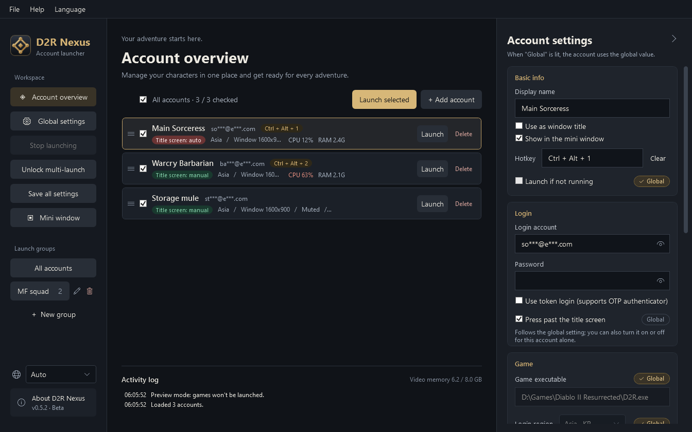
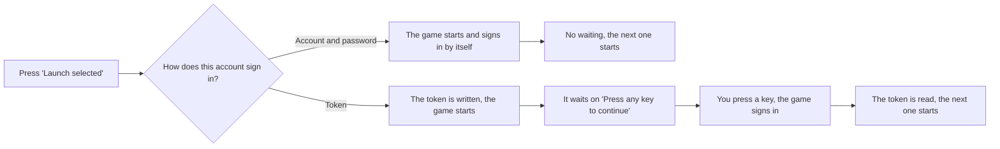
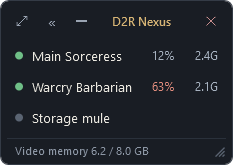

  

<h1 align="center">D2R Nexus</h1>

A multi-account launcher and manager for Diablo II: Resurrected (Windows)

<a href="README.md">繁體中文</a> · <a href="README.zh-CN.md">简体中文</a> · <b>English</b> · <a href="README.ko.md">한국어</a>

  
  

Check the accounts you want to play and click "Launch selected". Nexus opens each game for you, one after another, and unlocks the multi-launch limit automatically. Accounts with a phone authenticator (OTP) work too.

> Nexus is currently a beta. Some situations are still being tested on real setups.

<h2 align="center">⚠️ From v0.5.0, Nexus can send a key press to the game</h2>

<b>Off by default. You have to turn it on yourself, read what it does and agree to it. 
Once it is on, the program is operating the game for you, and the risk to your account is yours.</b>

<b>Each account also decides for itself. 
To keep your main account or a mule out of this entirely, leave it off for that account.</b>

> [!IMPORTANT]
> **What changed in v0.5.0: Nexus can now press past the game's title screen for you.**
>
> **Up to v0.4.6**, Nexus never sent any key to the game, and said so. **From v0.5.0** there is one feature that does: it presses "Press any key to continue" for you.
>
> - The feature is **off by default**. Leave it off and Nexus behaves exactly as it did before, sending no keys at all.
> - To use it you have to turn it on yourself under "Global settings → Help with signing in". You are first shown what it does, and the agree button only becomes available after a five-second countdown.
> - Once it is on, the program is operating the game for you. **The risk to your account is yours**, so weigh it before you decide.
> - **Every row in the account list says so.** An account the program presses for is marked **"Title screen: auto" in red**; one it leaves alone is **"Title screen: manual" in green**, so you can see which accounts use the feature without opening anything. With no account using it, the mark does not appear at all.
> - **Each account has its own switch too.** To keep your main account or a mule out of it entirely, turn off "Use the global setting" on that account and leave it off. Turning it on for one account asks you again.
>
> What it does, how far it goes and when it stops are in the [security notes](SECURITY.en.md).

## ✨ Features

**Multi-launch and login**

- **One-click multi-launch** — check your accounts and they open one by one in the order you set, with the multi-launch limit unlocked automatically
- **OTP authenticator support** — approve once on your phone, then launch directly from then on
- **Groups** — check the accounts you often play together with one click

**Each account can have its own settings**

- **Login region, windowed mode, mute, MOD, extra launch options**
- **Game settings** — window size, frame cap, CPU priority, and named graphics and sound groups. High quality on your main account, low on the mules, each account on its own group
- **Game options kept the same across accounts** — there is only one game options file and the games overwrite each other's; with this on every account gets the same one, so what you changed in one is not wiped out by another (off by default)
- **Window renaming** — the game's title changes to the account name, so you won't mix them up when running several

**Other**

- **No installation** — a single exe, no need to install .NET separately
- **Screen privacy** — accounts are masked automatically; passwords and tokens are saved on your PC with Windows encryption
- **Mini window** — a small list that stays on screen, showing at a glance which games are open; click to switch to one, or to launch one that isn't open, and drag its edges to resize it
- **You can see what is in use** — running accounts show their CPU and memory, and the whole graphics card's memory is there too, so you know before starting one more
- **Hotkeys** — one per account; press it to switch straight to that game
- **Tray icon** — when you click the close button, you can choose to minimize to the system tray (bottom right of the taskbar) and the program keeps running
- **Multilingual interface** — 繁體中文, 简体中文, English, 한국어; switch with the globe icon at the bottom left or the "Language" menu at the top
- **Update check** — tells you when a new version is out; never downloads or installs anything automatically, and can be turned off

## ⬇️ Download

Download `D2RNexus.exe` from [Releases](https://github.com/MoroseDog/D2RNexus/releases), put it in any folder, and run it. [Changelog](CHANGELOG.en.md)

| Requirement | |
|---|---|
| System | Windows 10 / 11 (64-bit) |
| Game | Diablo II: Resurrected installed |
| WebView2 | Needed for OTP login; usually already built into Windows 10 / 11 |
| Internet | Signing in to Battle.net; downloading an official Microsoft tool the first time you multi-launch; checking for a new version at startup (can be turned off) |

Nexus doesn't have a paid code-signing certificate, so you'll see warnings: when downloading in Edge, click the **∨** (or "…") next to "Delete" → "Keep anyway"; when running it, click "More info" → "Run anyway". See the [security notes](SECURITY.en.md) for why; the VirusTotal scan results for each version are included in the release notes.

## 🚀 Quick start

1. Open Nexus and click "Yes" when Windows asks for administrator permission.
2. Nexus finds the game automatically. If "Game found" doesn't appear in the activity log, go to "Global settings" on the left and click "Find automatically". If it still can't find it, click "Browse…" and select `D2R.exe`.
3. Go back to "Account overview", edit the demo account or click "+ Add account", and fill in the login account, password, and login region.
4. For accounts with an authenticator, check "Use token login", click "Get token", and approve once on your phone.
5. Check the accounts you want to open and click "Launch selected".

Drag the ≡ on the left of an account to change the launch order. A lit "Global" toggle means that item uses the global setting; click it to give the account its own setting.

> 💡 When running several games, lower the **Frame cap** of your background accounts set their **CPU priority** to "Low" and put them on a low **Graphics** group — your main account will run a bit smoother.

### The order token accounts start in

```mermaid
flowchart LR
    A["Press 'Launch selected'"] --> B{"How does this account sign in?"}
    B -->|Account and password| C["The game starts and signs in by itself"]
    C --> D["No waiting, the next one starts"]
    B -->|Token| E["The token is written, the game starts"]
    E --> F["It waits on 'Press any key to continue'"]
    F --> G["You press a key, the game signs in"]
    G --> H["The token is read, the next one starts"]
```

Windows holds only one token at a time, so two token accounts cannot start together: **until you press a key in the previous game's window, the accounts behind it keep waiting** — the activity log says which one they are waiting for and for how long. Accounts that sign in with an account and password do it by themselves and are not affected.

### Mini window

While you play, shrink the main window into a small list and keep it in a corner of the screen:

A green dot means the game is open (click to switch to it), a gray dot means it isn't (click to launch it), and an orange dot means the game isn't responding (right-click to close it). Next to each dot is the CPU and memory that account is using.

With many accounts the list gets long: to leave one out, right-click its row and choose "Hide from this list", or untick "Show in the mini window" in the account settings. Under the list it says how many are not shown and how many of those are running; the arrow next to it opens them, and clicking one puts it back on the list. A hidden account still launches as usual and keeps its shortcut.

The accounts whose games are open are moved to the top of the list, so with many accounts you do not have to scroll to find them; turn off "Open games at the top" in the panel's right-click menu if you would rather keep the order. Drag the window's edges to resize it; the list scrolls when it no longer fits. The bottom line is the memory in use on the **whole graphics card**, shown as a percentage while the window is collapsed and coloured once nine tenths of it is gone. Each row of the account list shows the CPU and memory that account's game is using as well.

## 🛡️ Not a cheat

Nexus is only a management tool that opens the game for you. **It doesn't inject code, doesn't read or write game memory, doesn't modify game files, doesn't intercept network traffic, doesn't bot, farm or loot for you, doesn't bypass verification, and doesn't upload your data.** Every method it uses, the permissions it needs, and everything it connects to are listed in the [security notes](SECURITY.en.md).

There is one exception, **added in v0.5.0 and off by default**: **pressing past the title screen** (up to v0.4.6 the feature did not exist and Nexus sent no keys at all). A game signed in with a token stops at "Press any key to continue" until someone presses a key. With this turned on, Nexus sends a single space bar to the game window it opened itself, and stops as soon as the sign-in is finished. That is the program operating the game for you, so before it can be turned on you are shown exactly what it does, and the agree button only becomes available after a five-second countdown; the time you agreed and the text you agreed to stay on your own computer and are not uploaded anywhere. With it off, Nexus sends no keys at all, and it never records what you press.

**The switch is also per account.** Even with the global setting on, an individual account can be left off: keep your main account and your mules out of this, and if anything does go wrong, the accounts that never used it are not involved. Turning it on for a single account asks you to agree again.

Whether multi-launching and third-party tools comply with the rules is ultimately determined by Blizzard's terms of use and rulings. Nexus cannot guarantee that your accounts will not be penalized in any way, and turning the key press on means taking that risk on knowingly, so decide for yourself first.

## ❓ FAQ

- **"Unable to authenticate"** — an account with an authenticator has to use token login; without one, check the password and the email.
- **Stuck on "Press any key to begin"** — that is the game itself: it waits for a key in that window before it logs in, and the next token account waits for it.
- **Will updating lose my settings?** — No. An update only replaces the exe; accounts and settings live in a separate folder.

Everything else (connection, game settings, permissions, removal…) is in the [FAQ](docs/faq.en.md).

## 🐛 Reporting problems

Describe what happened in [Issues](https://github.com/MoroseDog/D2RNexus/issues), and include your operating system, game version, Nexus version, login method, and the log (menu at the top: "Help → Open log folder").

Issues are public, so please don't post passwords, tokens, your full email, or your BattleTag, and cover your accounts in screenshots first.

## 📄 License

Copyright © 2026 J.J. Huang. All rights reserved. Free for personal use. You may not modify, redistribute, or sell it without the author's written permission. See [LICENSE.txt](LICENSE.txt) for the full terms and [THIRD-PARTY-NOTICES.txt](THIRD-PARTY-NOTICES.txt) for third-party component licenses.

D2R Nexus is an unofficial tool and is not affiliated with, endorsed, or supported by Blizzard Entertainment. Diablo® II: Resurrected and Battle.net® are trademarks or registered trademarks of Blizzard Entertainment, Inc. You use it at your own risk.
