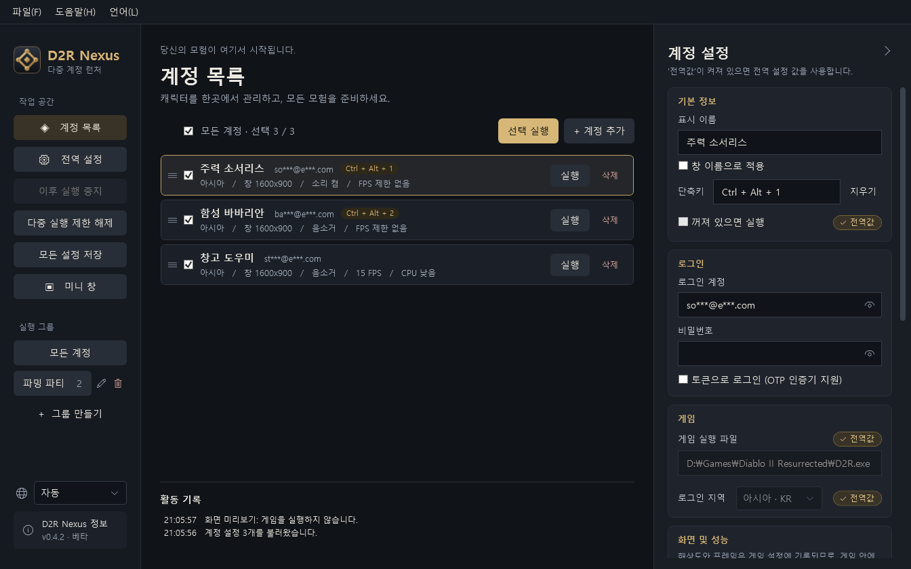
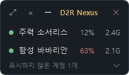

  

<h1 align="center">D2R Nexus</h1>

디아블로 II: 레저렉션 다중 계정 실행 및 관리 도구 (Windows)

<a href="README.md">繁體中文</a> · <a href="README.zh-CN.md">简体中文</a> · <a href="README.en.md">English</a> · <b>한국어</b>

  
  

플레이할 계정을 선택하고 '선택 실행'을 한 번 누르면, Nexus가 게임을 하나씩 차례대로 열고 다중 실행 제한도 자동으로 해제합니다. 휴대폰 인증기(OTP)를 연결한 계정도 사용할 수 있습니다.

> 현재 베타 버전이며, 일부 상황은 아직 실제 환경에서 검증하고 있습니다.

## ✨ 기능

**다중 실행과 로그인**

- **한 번에 다중 실행** — 계정을 선택하면 정해 둔 순서대로 하나씩 열고, 다중 실행 제한을 자동으로 해제합니다
- **OTP 인증기 지원** — 휴대폰에서 한 번만 승인하면 그다음부터는 바로 실행됩니다
- **그룹** — 자주 함께 플레이하는 계정을 한 번에 선택합니다

**계정마다 따로 설정 가능**

- **로그인 지역, 창 모드, 음소거, MOD, 추가 인수**
- **화면 및 성능** — 창 해상도, 프레임 제한, CPU 우선순위. 백그라운드 계정은 프레임을 낮게 고정하고 우선순위를 낮춰, 자원을 주력 계정에 몰아줄 수 있습니다
- **창 이름 변경** — 게임 창 제목을 계정 이름으로 바꿔, 여러 개를 열어도 헷갈리지 않습니다

**기타**

- **설치 불필요** — exe 파일 하나로 실행되며, .NET을 따로 설치할 필요가 없습니다
- **화면 개인정보 보호** — 계정은 자동으로 가려서 표시하고, 비밀번호와 토큰은 Windows 암호화로 이 PC에 저장합니다
- **미니 창** — 항상 떠 있는 작은 목록으로 어떤 게임이 켜져 있는지 한눈에 보고, 클릭 한 번으로 전환하거나 꺼진 계정을 실행합니다
- **단축키** — 계정마다 하나씩 지정해, 누르면 바로 그 게임으로 전환합니다
- **알림 영역 아이콘** — 닫기 버튼을 누를 때 작업 표시줄 오른쪽 아래(알림 영역)로 보내도록 선택할 수 있으며, 프로그램은 계속 실행됩니다
- **다국어 인터페이스** — 繁體中文, 简体中文, English, 한국어. 왼쪽 아래의 지구본 아이콘이나 위쪽 '언어' 메뉴에서 바꿀 수 있습니다
- **새 버전 확인** — 새 버전이 나오면 알려 줍니다. 자동으로 다운로드하거나 설치하지 않으며, 끌 수 있습니다

## ⬇️ 다운로드

[Releases](https://github.com/MoroseDog/D2RNexus/releases)에서 `D2RNexus.exe`를 다운로드해 아무 폴더에나 두고 바로 실행하세요. [버전 기록](CHANGELOG.ko.md)

| 요구 사항 | |
|---|---|
| 운영체제 | Windows 10 / 11 (64비트) |
| 게임 | 디아블로 II: 레저렉션 설치 |
| WebView2 | OTP 로그인 시 필요하며, Windows 10 / 11에는 보통 기본으로 들어 있습니다 |
| 인터넷 | Battle.net 로그인, 처음 다중 실행할 때 Microsoft 공식 도구 다운로드, 프로그램을 열 때 새 버전 확인(끌 수 있음) |

이 프로그램은 코드 서명 인증서를 구입하지 않아서 경고가 표시됩니다. Edge에서 다운로드할 때는 '삭제' 옆의 **∨**(또는 '…') → '유지'를 누르고, 실행할 때는 '추가 정보' → '실행'을 누르세요. 이유는 [보안 안내](SECURITY.ko.md)를 참고하세요. 버전마다 VirusTotal 검사 결과를 Release 설명에 첨부합니다.

## 🚀 빠른 시작

1. Nexus를 열고, Windows가 관리자 권한을 요청하면 '예'를 누르세요.
2. Nexus가 게임을 자동으로 찾습니다. 활동 기록에 '게임을 찾았습니다'가 나오지 않으면 왼쪽의 '전역 설정'에서 '자동 찾기'를 누르고, 그래도 찾지 못하면 '찾아보기…'를 눌러 `D2R.exe`를 선택하세요.
3. '계정 목록'으로 돌아가 예시 계정을 수정하거나 '+ 계정 추가'를 누르고, 로그인 계정, 비밀번호, 로그인 지역을 입력하세요.
4. 인증기를 연결한 계정은 '토큰으로 로그인'을 체크하고 '토큰 받기'를 누른 뒤 휴대폰에서 한 번 승인하세요.
5. 실행할 계정을 선택하고 '선택 실행'을 누르세요.

계정 왼쪽의 ≡를 드래그하면 실행 순서를 바꿀 수 있습니다. '전역값'이 켜져 있으면 그 항목은 전역 설정을 사용하며, 한 번 누르면 이 계정만의 설정으로 바뀝니다.

> 💡 여러 개를 실행할 때 백그라운드 계정의 **프레임 제한**을 낮추고 **CPU 우선순위**를 '낮음'으로 설정하면 주력 계정이 조금 더 부드러워집니다.

### 미니 창

게임을 하는 동안 메인 창을 작은 목록으로 줄여 화면 구석에 둘 수 있습니다.

초록 점은 게임이 켜져 있다는 뜻이고(클릭하면 그 게임으로 전환), 회색 점은 꺼져 있다는 뜻이며(클릭하면 실행), 주황 점은 게임이 응답하지 않는다는 뜻입니다(마우스 오른쪽 버튼으로 종료 가능). 옆에는 그 계정이 사용 중인 CPU와 메모리가 표시됩니다.

## 🛡️ 핵이 아닙니다

Nexus는 게임 실행을 도와주는 관리 도구일 뿐이며, **프로그램을 주입하지 않고, 게임 메모리를 읽거나 쓰지 않고, 게임 파일을 수정하지 않고, 네트워크 통신을 가로채지 않고, 게임을 자동으로 조작하지 않고, 키보드와 마우스 입력을 흉내 내지 않고, 인증을 우회하지 않으며, 사용자의 데이터를 업로드하지 않습니다**. 각 동작 방식과 필요한 권한, 연결 대상은 모두 [보안 안내](SECURITY.ko.md)에 적어 두었습니다.

다중 실행과 타사 도구가 규정에 맞는지는 최종적으로 Blizzard의 이용 약관과 판단에 따르며, Nexus는 계정이 어떠한 제재도 받지 않는다고 보장할 수 없습니다.

## ❓ 자주 묻는 질문

Battle.net에 연결할 때 인증할 수 없다는 메시지가 나옵니다

게임은 이미 열렸고, Battle.net이 로그인을 거부한 것이므로 다중 실행과는 관계가 없습니다. 다음을 차례대로 확인하세요.

1. 계정에 인증기가 연결되어 있다면 → '토큰으로 로그인'으로 바꾸고 토큰을 받으세요
2. 비밀번호가 맞는지 (비밀번호를 바꿨다면 다시 입력해야 합니다)
3. 로그인 계정(이메일)을 잘못 입력하지 않았는지
4. 토큰을 쓰는 계정이 인증기를 다시 연결했다면 '지우기'를 누른 뒤 토큰을 다시 받으세요
5. Battle.net 런처로 먼저 한 번 로그인해 보안 인증을 마친 뒤 다시 시도하세요

Battle.net에 연결하는 단계에서 계속 멈춰 있습니다

게임은 이미 열렸고 다중 실행도 성공했지만, 로그인할 때 Battle.net이 응답하지 않는 상황입니다. 다음을 차례대로 시도해 보세요.

1. 게임을 닫고 Battle.net 런처로 이 계정에 한 번 로그인하세요. '로봇이 아닙니다' 같은 인증이 나오면 끝까지 완료하고, 잠시 기다린 뒤 다시 여세요. 짧은 시간에 로그인을 너무 많이 하거나 비밀번호를 몇 번 틀리면 Battle.net이 인증을 요구하는데, Nexus로 연 게임에는 인증을 할 곳이 없어서 계속 멈춰 있을 수 있습니다
2. VPN이나 게임 가속기를 켜 두었다면 끄고 다시 시도하세요
3. Battle.net 런처로 게임을 열어도 멈춘다면 네트워크나 서버 문제이며, 다중 실행과는 관계가 없습니다

그래도 안 되면 Issues에 로그인 방식(계정/비밀번호 또는 토큰), 몇 번째 계정부터 멈추는지, 그리고 로그를 함께 올려 주세요.

토큰으로 로그인한 계정이 오프라인으로만 들어가집니다

그 토큰이 만료된 것입니다. Battle.net 비밀번호를 바꾸거나 인증기를 다시 연결하거나 해제하면 토큰이 무효가 됩니다.

계정 설정의 '로그인 토큰'에서 '지우기'를 누른 뒤 '토큰 받기'를 다시 눌러 휴대폰에서 한 번 더 승인하세요. 인증기를 연결하지 않은 계정이라면 '토큰으로 로그인' 체크를 해제하고 계정과 비밀번호로 로그인해도 됩니다.

Apple, Google 등으로 로그인해서 Battle.net 비밀번호가 없습니다

토큰을 받는 페이지는 이메일과 비밀번호만 받습니다. 로그인 창 오른쪽 위의 '다른 방법으로 로그인'을 눌러 평소 방법으로 로그인한 뒤 '로그인 완료'를 누르세요. 자세한 단계는 [Apple, Google 등으로 로그인하기 (중국어)](docs/apple-login.md)를 참고하세요.

Nexus가 게임 안에서 바꾼 설정을 건드리나요?

'화면 및 성능'에서 설정한 **창 해상도**와 **프레임 제한**만 기록하며, 다른 게임 설정(그래픽 품질, 음량, 자동 지도, 키 설정 등)은 전혀 건드리지 않습니다.

이 두 항목은 Nexus가 정하기 때문에, 게임 안에서 바꾸더라도 다음 실행 때 계정 설정 값으로 덮어써집니다. 게임에서 맞춰 둔 값을 기본값으로 쓰고 싶다면 '전역 설정 → 화면 및 성능'에서 '현재 게임 설정 읽기'를 한 번 누르세요.

CPU 우선순위는 어디에 쓰나요?

여러 개를 실행하면 모든 게임이 CPU를 두고 경쟁합니다. 백그라운드 계정을 '낮음'으로 설정하면 주력 계정이 CPU를 먼저 사용하게 되어 끊김이 조금 줄어듭니다.

단, 이 설정은 **CPU 사용률을 낮추지 않습니다**. 누가 먼저 쓰느냐만 정할 뿐입니다. 실행하는 게임 수가 적어 CPU가 가득 차지 않는다면 설정해도 차이를 느끼지 못하니 '보통'으로 두세요.

단축키가 제가 누른 키를 기록하나요?

아니요. Nexus는 지정한 키 조합을 Windows에 **등록**할 뿐이며, 그 조합을 눌렀을 때만 Windows가 Nexus에 알려 줍니다. 다른 키 입력은 전혀 받지 않습니다. 이는 모든 키 입력을 가로채는 '키보드 후킹'과는 다른 방식이며, Nexus는 키보드 후킹을 사용하지 않습니다.

또한 키 조합을 시스템에 등록하기 때문에, Nexus가 실행되는 동안 그 조합은 다른 프로그램에 전달되지 않습니다. 그러니 설정할 때는 반드시 Ctrl, Alt, Win 중 하나를 포함하고, 게임에서 쓰는 단일 키는 사용하지 마세요.

창을 닫은 뒤에도 프로그램이 계속 실행되나요?

닫기 버튼을 누를 때 '알림 영역으로'를 선택하면 Nexus가 백그라운드에서 계속 실행됩니다. 작업 표시줄 오른쪽 아래의 아이콘을 누르면 다시 열 수 있고, 마우스 오른쪽 버튼 메뉴에 '메인 창 표시' / 'D2R Nexus 종료'가 있습니다.

이 선택은 기억해 둘 수 있으며, 나중에 바꾸려면 '전역 설정 → 창 → 닫기 버튼을 누르면'에서 변경하세요. 최소화 버튼을 누르면 일반 프로그램처럼 작업 표시줄에 남습니다.

관리자 권한은 왜 필요한가요?

다중 실행 제한을 해제하려면 필요하며, 프로그램을 열 때 한 번만 묻습니다. 거부해도 사용할 수 있지만 매번 다시 묻습니다. 게임도 관리자 권한으로 실행되므로, OBS나 Discord도 관리자 권한으로 실행해야 화면을 캡처할 수 있는 경우가 있습니다.

계정과 비밀번호는 어디에 저장되나요?

내 PC의 `%LOCALAPPDATA%\D2RNexus`에 저장됩니다. 비밀번호와 토큰은 Windows 기본 암호화로 보호해 저장하며 업로드하지 않습니다. 계정과 비밀번호로 로그인할 때는 비밀번호가 게임의 실행 인수로 전달되지만, 토큰으로 로그인할 때는 전달되지 않습니다.

'창 준비됨'이 표시되면 로그인에 성공한 건가요?

꼭 그렇지는 않습니다. Nexus는 창이 나타났는지만 확인할 수 있고 로그인이 끝났는지는 판단할 수 없으니, 게임 화면으로 확인하세요.

창 해상도는 얼마나 작게 설정할 수 있나요?

목록에는 게임이 지원하는 창 크기가 있으며, '직접 입력…'을 선택할 수도 있습니다. 최소 1280x720을 권장합니다. 그보다 작으면 게임 화면이 비율에 맞게 줄어들지 않고 그대로 잘려 나갑니다(인벤토리나 단축키 바가 보이지 않을 수 있습니다).

Nexus를 닫으면 게임도 닫히나요?

아니요. Nexus를 다시 열어도 전에 실행한 게임을 알아보기 때문에, 같은 계정이 중복으로 실행되지 않습니다.

완전히 삭제하려면 어떻게 하나요?

`D2RNexus.exe`와 `%LOCALAPPDATA%\D2RNexus` 폴더를 삭제하세요. 창 해상도 기능을 사용했다면 게임 설정 폴더의 `Settings.json.nexus-backup`도 삭제해도 됩니다.

## 🐛 문제 신고

[Issues](https://github.com/MoroseDog/D2RNexus/issues)에 상황을 설명하고, 운영체제, 게임 버전, Nexus 버전, 로그인 방식과 로그(위쪽 메뉴 '도움말 → 로그 폴더 열기')를 함께 올려 주세요.

Issues는 공개되어 있으니 비밀번호, 토큰, 전체 이메일 주소, BattleTag는 올리지 마시고, 스크린샷도 계정을 먼저 가려 주세요.

## 📄 라이선스

Copyright © 2026 J.J. Huang. All rights reserved. 개인 용도로 무료로 사용할 수 있으며, 제작자의 서면 동의 없이 수정, 재배포 또는 판매할 수 없습니다. 전체 조건은 [LICENSE.txt](LICENSE.txt), 타사 구성 요소의 라이선스는 [THIRD-PARTY-NOTICES.txt](THIRD-PARTY-NOTICES.txt)를 참고하세요.

D2R Nexus는 비공식 도구로서 Blizzard Entertainment와 관련이 없으며, Blizzard Entertainment의 승인이나 지원을 받지 않았습니다. Diablo® II: Resurrected 및 Battle.net®은 Blizzard Entertainment, Inc.의 상표 또는 등록 상표입니다. 사용에 따른 위험은 사용자가 부담합니다.
