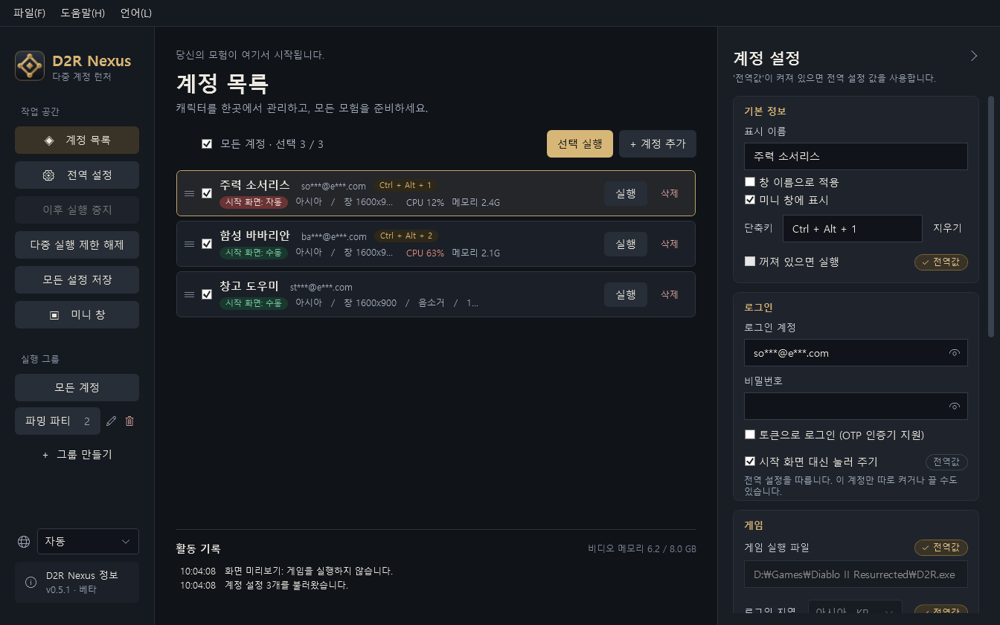
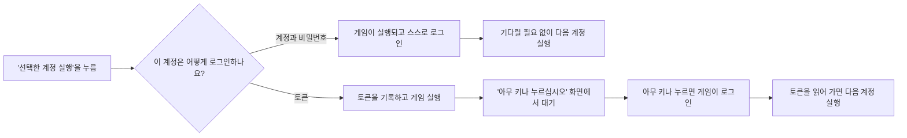
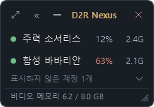

  

<h1 align="center">D2R Nexus</h1>

디아블로 II: 레저렉션 다중 계정 실행 및 관리 도구 (Windows)

<a href="README.md">繁體中文</a> · <a href="README.zh-CN.md">简体中文</a> · <a href="README.en.md">English</a> · <b>한국어</b>

  
  

플레이할 계정을 선택하고 '선택 실행'을 한 번 누르면, Nexus가 게임을 하나씩 차례대로 열고 다중 실행 제한도 자동으로 해제합니다. 휴대폰 인증기(OTP)를 연결한 계정도 사용할 수 있습니다.

> 현재 베타 버전이며, 일부 상황은 아직 실제 환경에서 검증하고 있습니다.

<h2 align="center">⚠️ v0.5.0부터 Nexus가 게임에 키 입력을 보낼 수 있습니다</h2>

<b>기본값은 꺼짐입니다. 직접 켜고 안내를 읽은 뒤 동의해야 작동합니다. 
켜면 프로그램이 게임을 대신 조작하는 것이며, 계정에 대한 위험은 본인이 감수합니다.</b>

<b>계정마다 따로 정할 수도 있습니다. 
주 계정이나 창고 계정을 완전히 제외하려면 그 계정에서 꺼 두세요.</b>

> [!IMPORTANT]
> **v0.5.0의 변경 사항: 이제 Nexus가 게임의 시작 화면을 대신 눌러 줄 수 있습니다.**
>
> **v0.4.6까지** Nexus는 게임에 어떤 키도 보내지 않았고, 안내에도 그렇게 적혀 있었습니다. **v0.5.0부터**는 '아무 키나 누르십시오'를 대신 눌러 주는 기능이 하나 생겼습니다.
>
> - 이 기능의 **기본값은 꺼짐**입니다. 켜지 않으면 Nexus의 동작은 이전과 완전히 같으며 어떤 키도 보내지 않습니다.
> - 쓰려면 '전역 설정 → 로그인 도우미'에서 직접 켜야 합니다. 무엇을 하는지 먼저 안내하고, 5초를 센 뒤에야 동의 버튼을 누를 수 있습니다.
> - 켜면 프로그램이 게임을 대신 조작하는 것이 됩니다. **계정에 대한 위험은 본인이 감수**하므로 충분히 생각한 뒤에 결정하세요.
> - **계정 목록의 모든 행에 표시됩니다.** 프로그램이 대신 눌러 주는 계정은 **빨간색 '시작 화면: 자동'**, 그렇지 않은 계정은 **초록색 '시작 화면: 수동'**으로 표시되어 아무것도 열지 않고도 어떤 계정이 이 기능을 쓰는지 알 수 있습니다. 사용하는 계정이 하나도 없으면 이 표시는 나타나지 않습니다.
> - **계정마다 별도의 스위치도 있습니다.** 주 계정이나 창고 계정을 완전히 제외하려면 그 계정에서 '전역 설정 사용'을 끄고 꺼진 상태로 두세요. 한 계정만 켤 때도 다시 한 번 확인합니다.
>
> 무엇을 어디까지 하고 언제 멈추는지는 [보안 안내](SECURITY.ko.md)에 적혀 있습니다.

## ✨ 기능

**다중 실행과 로그인**

- **한 번에 다중 실행** — 계정을 선택하면 정해 둔 순서대로 하나씩 열고, 다중 실행 제한을 자동으로 해제합니다
- **OTP 인증기 지원** — 휴대폰에서 한 번만 승인하면 그다음부터는 바로 실행됩니다
- **그룹** — 자주 함께 플레이하는 계정을 한 번에 선택합니다

**계정마다 따로 설정 가능**

- **로그인 지역, 창 모드, 음소거, MOD, 추가 인수**
- **게임 설정** — 창 해상도, 프레임 제한, CPU 우선순위, 그리고 화질·사운드 설정 그룹. 주력 계정은 높은 화질, 창고 계정은 낮은 화질로 계정마다 따로 적용합니다
- **여러 개를 띄울 때 게임 옵션 고정** — 게임 옵션 파일은 하나뿐이라 서로 덮어쓰지만, 켜 두면 모든 계정이 같은 값을 쓰므로 한 계정에서 바꾼 설정이 다른 계정에 지워지지 않습니다(기본 꺼짐)
- **창 이름 변경** — 게임 창 제목을 계정 이름으로 바꿔, 여러 개를 열어도 헷갈리지 않습니다

**기타**

- **설치 불필요** — exe 파일 하나로 실행되며, .NET을 따로 설치할 필요가 없습니다
- **화면 개인정보 보호** — 계정은 자동으로 가려서 표시하고, 비밀번호와 토큰은 Windows 암호화로 이 PC에 저장합니다
- **미니 창** — 항상 떠 있는 작은 목록으로 어떤 게임이 켜져 있는지 한눈에 보고, 클릭 한 번으로 전환하거나 꺼진 계정을 실행합니다. 가장자리를 끌어 크기를 조절할 수 있습니다
- **사용량이 보입니다** — 실행 중인 계정의 CPU와 메모리, 그리고 그래픽 카드 전체의 메모리 사용량을 함께 보여 주므로 하나 더 켜기 전에 확인할 수 있습니다
- **단축키** — 계정마다 하나씩 지정해, 누르면 바로 그 게임으로 전환합니다
- **알림 영역 아이콘** — 닫기 버튼을 누를 때 작업 표시줄 오른쪽 아래(알림 영역)로 보내도록 선택할 수 있으며, 프로그램은 계속 실행됩니다
- **다국어 인터페이스** — 繁體中文, 简体中文, English, 한국어. 왼쪽 아래의 지구본 아이콘이나 위쪽 '언어' 메뉴에서 바꿀 수 있습니다
- **새 버전 확인** — 새 버전이 나오면 알려 줍니다. 자동으로 다운로드하거나 설치하지 않으며, 끌 수 있습니다

## ⬇️ 다운로드

[Releases](https://github.com/MoroseDog/D2RNexus/releases)에서 `D2RNexus.exe`를 다운로드해 아무 폴더에나 두고 바로 실행하세요. [버전 기록](CHANGELOG.ko.md)

| 요구 사항 | |
|---|---|
| 운영체제 | Windows 10 / 11 (64비트) |
| 게임 | 디아블로 II: 레저렉션 설치 |
| WebView2 | OTP 로그인 시 필요하며, Windows 10 / 11에는 보통 기본으로 들어 있습니다 |
| 인터넷 | Battle.net 로그인, 처음 다중 실행할 때 Microsoft 공식 도구 다운로드, 프로그램을 열 때 새 버전 확인(끌 수 있음) |

이 프로그램은 코드 서명 인증서를 구입하지 않아서 경고가 표시됩니다. Edge에서 다운로드할 때는 '삭제' 옆의 **∨**(또는 '…') → '유지'를 누르고, 실행할 때는 '추가 정보' → '실행'을 누르세요. 이유는 [보안 안내](SECURITY.ko.md)를 참고하세요. 버전마다 VirusTotal 검사 결과를 Release 설명에 첨부합니다.

## 🚀 빠른 시작

1. Nexus를 열고, Windows가 관리자 권한을 요청하면 '예'를 누르세요.
2. Nexus가 게임을 자동으로 찾습니다. 활동 기록에 '게임을 찾았습니다'가 나오지 않으면 왼쪽의 '전역 설정'에서 '자동 찾기'를 누르고, 그래도 찾지 못하면 '찾아보기…'를 눌러 `D2R.exe`를 선택하세요.
3. '계정 목록'으로 돌아가 예시 계정을 수정하거나 '+ 계정 추가'를 누르고, 로그인 계정, 비밀번호, 로그인 지역을 입력하세요.
4. 인증기를 연결한 계정은 '토큰으로 로그인'을 체크하고 '토큰 받기'를 누른 뒤 휴대폰에서 한 번 승인하세요.
5. 실행할 계정을 선택하고 '선택 실행'을 누르세요.

계정 왼쪽의 ≡를 드래그하면 실행 순서를 바꿀 수 있습니다. '전역값'이 켜져 있으면 그 항목은 전역 설정을 사용하며, 한 번 누르면 이 계정만의 설정으로 바뀝니다.

> 💡 여러 개를 실행할 때 백그라운드 계정의 **프레임 제한**을 낮추고 **CPU 우선순위**를 '낮음'으로, **화질**을 낮은 설정 그룹으로 두면 주력 계정이 조금 더 부드러워집니다.

### 토큰 계정이 실행되는 순서

```mermaid
flowchart LR
    A["'선택한 계정 실행'을 누름"] --> B{"이 계정은 어떻게 로그인하나요?"}
    B -->|계정과 비밀번호| C["게임이 실행되고 스스로 로그인"]
    C --> D["기다릴 필요 없이 다음 계정 실행"]
    B -->|토큰| E["토큰을 기록하고 게임 실행"]
    E --> F["'아무 키나 누르십시오' 화면에서 대기"]
    F --> G["아무 키나 누르면 게임이 로그인"]
    G --> H["토큰을 읽어 가면 다음 계정 실행"]
```

Windows에는 토큰이 한 번에 하나만 저장되므로 토큰 계정 두 개를 동시에 실행할 수 없습니다. **앞 게임의 창에서 키를 누르기 전까지 뒤의 계정은 계속 기다립니다.** 활동 기록에 무엇을 얼마나 기다리는지 표시됩니다. 계정과 비밀번호로 로그인하는 계정은 스스로 로그인하므로 영향을 받지 않습니다.

### 미니 창

게임을 하는 동안 메인 창을 작은 목록으로 줄여 화면 구석에 둘 수 있습니다.

초록 점은 게임이 켜져 있다는 뜻이고(클릭하면 그 게임으로 전환), 회색 점은 꺼져 있다는 뜻이며(클릭하면 실행), 주황 점은 게임이 응답하지 않는다는 뜻입니다(마우스 오른쪽 버튼으로 종료 가능). 옆에는 그 계정이 사용 중인 CPU와 메모리가 표시됩니다.

계정이 많으면 목록이 길어집니다. 빼고 싶은 계정은 해당 줄에서 마우스 오른쪽 버튼을 눌러 '이 목록에서 숨기기'를 선택하거나, 계정 설정에서 '미니 창에 표시'를 끄세요. 목록 아래에는 표시하지 않은 계정이 몇 개인지, 그중 몇 개가 실행 중인지 표시되며, 옆의 화살표를 누르면 펼쳐지고 한 번 클릭하면 다시 목록에 넣습니다. 숨긴 계정도 평소처럼 실행되고 단축키도 그대로 작동합니다.

게임이 켜져 있는 계정은 목록 맨 위로 올라가므로 계정이 많아도 스크롤해서 찾을 필요가 없습니다. 원래 순서를 유지하려면 패널에서 마우스 오른쪽 버튼을 눌러 '실행 중인 계정을 맨 위로'를 끄세요. 창 가장자리를 끌어 크기를 조절할 수 있고, 목록이 넘치면 스크롤됩니다. 맨 아래 줄은 **그래픽 카드 전체**의 메모리 사용량이며, 창을 접으면 백분율로 표시되고 90%를 넘으면 색이 바뀝니다. 계정 목록의 각 줄에도 그 계정의 게임이 쓰는 CPU와 메모리가 표시됩니다.

## 🛡️ 핵이 아닙니다

Nexus는 게임 실행을 도와주는 관리 도구일 뿐이며, **프로그램을 주입하지 않고, 게임 메모리를 읽거나 쓰지 않고, 게임 파일을 수정하지 않고, 네트워크 통신을 가로채지 않고, 자동 사냥이나 자동 줍기를 하지 않고, 인증을 우회하지 않으며, 사용자의 데이터를 업로드하지 않습니다**. 각 동작 방식과 필요한 권한, 연결 대상은 모두 [보안 안내](SECURITY.ko.md)에 적어 두었습니다.

예외는 하나뿐이며 **v0.5.0에서 추가되었고 기본값은 꺼짐**입니다. 바로 **시작 화면 대신 눌러 주기**입니다(v0.4.6까지는 이 기능이 없었고 Nexus는 어떤 키도 보내지 않았습니다). 토큰으로 로그인한 게임은 '아무 키나 누르십시오'에서 누군가 키를 누를 때까지 멈춰 있습니다. 이 기능을 켜면 Nexus가 직접 실행한 그 게임 창에만 스페이스바 하나를 보내 대신 눌러 주고, 로그인이 끝나면 멈춥니다. 이는 프로그램이 게임을 대신 조작하는 것이므로, 켜기 전에 무엇을 하는지 안내 창이 뜨고 5초를 센 뒤에야 동의 버튼을 누를 수 있으며, 동의한 시각과 그때의 안내문은 사용자 컴퓨터에 남으며 어디에도 업로드되지 않습니다. 켜지 않으면 Nexus는 어떤 키도 보내지 않으며, 무엇을 눌렀는지도 기록하지 않습니다.

**이 스위치는 계정마다 따로 있습니다.** 전역 설정을 켜더라도 개별 계정은 꺼 둘 수 있습니다. 주 계정과 창고 계정을 이 기능에서 제외해 두면, 문제가 생기더라도 사용하지 않은 계정은 함께 엮이지 않습니다. 한 계정만 켤 때는 다시 한 번 동의해야 합니다.

다중 실행과 타사 도구가 규정에 맞는지는 최종적으로 Blizzard의 이용 약관과 판단에 따르며, Nexus는 계정이 어떠한 제재도 받지 않는다고 보장할 수 없습니다. 자동 키 입력을 켜는 것은 그만큼의 위험을 스스로 지는 일이므로 충분히 생각한 뒤에 결정하세요.

## ❓ 자주 묻는 질문

- **「인증할 수 없습니다」가 뜹니다** — 인증기를 연결한 계정은 토큰 로그인으로 바꿔야 하고, 아니라면 비밀번호와 로그인 계정을 확인하세요.
- **「아무 키나 누르십시오」에서 멈춥니다** — 게임이 원래 그렇습니다. 그 창에서 키를 눌러야 로그인이 시작되고, 다음 토큰 계정은 그때까지 기다립니다.
- **업데이트하면 설정이 사라지나요?** — 아니요. exe만 교체되며 계정과 설정은 다른 폴더에 있습니다.

그 밖의 질문(접속, 게임 설정, 권한, 삭제 등)은 [자주 묻는 질문](docs/faq.ko.md)에 정리해 두었습니다.

## 🐛 문제 신고

[Issues](https://github.com/MoroseDog/D2RNexus/issues)에 상황을 설명하고, 운영체제, 게임 버전, Nexus 버전, 로그인 방식과 로그(위쪽 메뉴 '도움말 → 로그 폴더 열기')를 함께 올려 주세요.

Issues는 공개되어 있으니 비밀번호, 토큰, 전체 이메일 주소, BattleTag는 올리지 마시고, 스크린샷도 계정을 먼저 가려 주세요.

## 📄 라이선스

Copyright © 2026 J.J. Huang. All rights reserved. 개인 용도로 무료로 사용할 수 있으며, 제작자의 서면 동의 없이 수정, 재배포 또는 판매할 수 없습니다. 전체 조건은 [LICENSE.txt](LICENSE.txt), 타사 구성 요소의 라이선스는 [THIRD-PARTY-NOTICES.txt](THIRD-PARTY-NOTICES.txt)를 참고하세요.

D2R Nexus는 비공식 도구로서 Blizzard Entertainment와 관련이 없으며, Blizzard Entertainment의 승인이나 지원을 받지 않았습니다. Diablo® II: Resurrected 및 Battle.net®은 Blizzard Entertainment, Inc.의 상표 또는 등록 상표입니다. 사용에 따른 위험은 사용자가 부담합니다.
