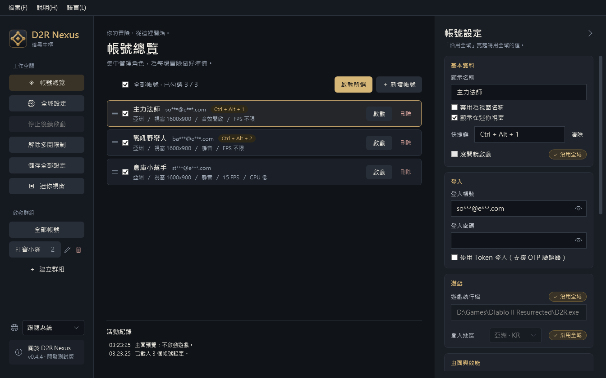

  

<h1 align="center">D2R Nexus · 暗黑中樞</h1>

《暗黑破壞神 II：獄火重生》多帳號啟動與管理工具（Windows）

  
  

> **目前為開發測試版（0.2）**：主要功能已可使用，部分情境仍在實機驗證中。

## 這是什麼？

把多個 Battle.net 帳號集中在一個視窗管理：勾選要玩的帳號，按一下「啟動所選」，Nexus 就會依序幫你開好每一個遊戲。有綁手機驗證器（OTP）的帳號也能使用。

## 功能

- **一鍵多開**：依你排好的順序逐一開啟，並自動解除遊戲的多開限制。
- **支援 OTP 驗證器**：第一次在手機上核准登入後，之後就能直接啟動。
- **群組**：把常一起玩的帳號存成群組，點一下就勾好。
- **每個帳號獨立設定**：登入地區、視窗模式與解析度、靜音、MOD、額外參數；不想逐一設定就沿用全域預設。
- **視窗改名**：遊戲視窗標題改成帳號名稱，切換視窗不再認錯。
- **畫面隱私**：畫面上的登入帳號自動打碼，實況或截圖不怕外流。
- **安全保存**：密碼與登入 Token 以 Windows 內建加密保存在你的電腦。
- **免安裝**：下載一個 exe 就能執行，不需要另外安裝 .NET。

## 這個程式做了什麼、沒做什麼

D2R Nexus 只是「幫你開遊戲」的管理工具。它做的事和你自己手動開遊戲、調整設定差不多，只是一次處理多個帳號。

**不做的事**

- 不注入任何程式（例如 DLL）到遊戲裡，也不修改遊戲的程式檔案。
- 不讀取或修改遊戲的記憶體內容（角色、物品、地圖等）。
- 不攔截或修改遊戲的網路連線。
- 不自動操作遊戲：沒有掛機、自動打怪、自動撿物、巨集，也不模擬鍵盤滑鼠。
- 不繞過 Battle.net 的人機驗證或手機驗證。
- 不收集你的帳號資料，也不會上傳到任何伺服器。

**實際做的事**

| 功能 | 做法 |
|---|---|
| 啟動遊戲 | 用遊戲本身支援的啟動參數執行 `D2R.exe`，例如指定帳號、地區、視窗模式、靜音、MOD |
| OTP 帳號登入 | 開啟 Battle.net 官方登入網頁，你在手機核准後取得登入 Token，寫入 Battle.net 啟動器本身使用的 Windows 登錄位置 |
| 同時開多個遊戲 | 用微軟官方工具 Sysinternals Handle，關閉遊戲用來檢查「是否已經開過一個」的 Windows 系統標記；不改遊戲檔案，也不碰遊戲記憶體 |
| 視窗改名 | 用 Windows 標準功能修改遊戲視窗的標題文字 |
| 視窗解析度 | 修改遊戲自己的設定檔（Settings.json）裡的視窗大小，和在遊戲選項中調整相同 |

> Nexus 不做任何侵入或自動操作遊戲的行為，但多開與第三方工具是否符合規範，最終以 Blizzard 的使用條款與判定為準，Nexus 無法保證帳號不會受到任何處分。

## 下載與系統需求

到 [Releases](https://github.com/MoroseDog/D2RNexus/releases) 下載 `D2RNexus.exe`，放在任意資料夾直接執行即可。

| 項目 | 需求 |
|---|---|
| 作業系統 | Windows 10 / 11（64 位元） |
| 遊戲 | 已安裝《暗黑破壞神 II：獄火重生》 |
| WebView2 Runtime | OTP 帳號登入時需要；Windows 11 內建，Windows 10 通常已隨 Edge 安裝 |
| 網路 | 登入 Battle.net；第一次多開時下載微軟官方工具 |

> 第一次執行時，Windows 可能顯示「Windows 已保護您的電腦」，這是因為程式沒有購買程式碼簽章。請按「其他資訊」→「仍要執行」。

## 快速開始

1. 開啟 Nexus，Windows 會詢問管理員權限，請按「是」（原因見[常見問題](#常見問題)）。
2. 左側「全域設定」→「瀏覽遊戲執行檔…」，選擇遊戲資料夾中的 `D2R.exe`。
3. 回到「帳號總覽」。第一次開啟會有三個示範帳號，可以直接修改，或按「＋ 新增帳號」。
4. 點選帳號，在右側填入顯示名稱、登入帳號、密碼與登入地區。
5. 帳號有綁 OTP 驗證器的話，勾選「使用 Token 登入」，請看下一節。
6. 勾選要開的帳號，按「啟動所選」。

小技巧：拖曳帳號左側的 ≡ 可以調整啟動順序；清單上方的勾選框可以一次全選或全部取消；帳號設定裡亮起的「沿用全域」表示該項使用全域設定，點一下就能改成個別設定。

## 有 OTP 驗證器的帳號

Battle.net 不允許用帳號密碼直接登入有驗證器的帳號，所以 Nexus 改用「登入 Token」：

1. 在帳號設定勾選「使用 Token 登入（支援 OTP 驗證器）」，按「取得 Token」（或直接啟動）。
2. 會跳出 Battle.net 登入視窗，Nexus 自動填入帳號與密碼。
3. 在手機上核准登入，視窗會自動關閉，Token 就保存好了。
4. 之後直接啟動即可，不用每次核准。

- 如果出現人機驗證，請在登入視窗內自行完成。
- 停用或重新綁定驗證器後 Token 會失效，按「清除」後重新取得即可。
- Token 等同免驗證的登入憑證，請不要分享給別人。

## 同時開多個遊戲

遊戲預設只允許開一個。Nexus 在開下一個之前會自動解除這個限制：

- 這需要微軟官方的免費工具 Sysinternals Handle。第一次多開時會詢問是否下載（約 750 KB），確認是微軟簽章的檔案後才會使用，之後不會再下載。
- 想改用 Battle.net 啟動器開遊戲時，先按左側「解除多開限制」，再從啟動器開下一個。

## 常見問題

為什麼需要管理員權限？

解除多開限制需要管理員權限。Nexus 開啟時只詢問一次，之後開多個遊戲不會再跳出詢問。拒絕的話 Nexus 仍可使用，只是每次需要解除多開限制時會再詢問。

遊戲會跟著以管理員權限執行，錄影或疊加軟體（例如 OBS、Discord）可能也要以管理員權限執行才能擷取遊戲畫面。

帳號密碼存在哪裡？安全嗎？

所有設定都在你電腦的 `%LOCALAPPDATA%\D2RNexus`。密碼與 Token 以 Windows 內建的資料保護加密，只有同一個 Windows 使用者能解開。除了登入 Battle.net 本身，Nexus 不會把它們傳到其他地方。

以帳號密碼方式登入時，密碼會作為遊戲的啟動參數傳給遊戲；使用 Token 登入則不會。

顯示「視窗就緒」就代表登入成功了嗎？

不一定。Nexus 只能確認遊戲視窗已經出現，無法判斷是否登入完成，請以遊戲畫面為準。

視窗解析度為什麼只有這幾個選項？

這些是遊戲本身支援的視窗大小，其他尺寸會讓畫面被裁切。選「不變更」就沿用遊戲上次的設定。

關掉 Nexus 會把遊戲一起關掉嗎？

不會。重新開啟 Nexus 後，它仍認得之前開的遊戲，不會讓同一個帳號重複開啟。

如何完全移除？

刪除 `D2RNexus.exe` 與資料夾 `%LOCALAPPDATA%\D2RNexus`（設定、加密的密碼與 Token、紀錄檔、下載的工具都在裡面）。若用過視窗解析度功能，遊戲設定資料夾中的 `Settings.json.nexus-backup` 是 Nexus 建立的備份，也可以一併刪除。

遇到問題怎麼回報？

請到 [Issues](https://github.com/MoroseDog/D2RNexus/issues) 按「New issue」描述狀況，並盡量附上：

- 作業系統（例如 Windows 11）
- 遊戲版本（例如 3.3.93847）與 D2R Nexus 版本（上方選單「說明 → 關於 D2R Nexus」）
- 登入方式（帳號密碼或 Token）與同時開啟的帳號數量
- 發生了什麼、怎麼操作會發生
- 日誌內容或截圖

日誌在上方選單「說明 → 開啟日誌資料夾」，其中「環境：」那一行已記錄作業系統與遊戲版本。日誌中的帳號已打碼，也不含密碼或 Token，但貼上前仍請再檢查一次。

Issues 是公開的，請不要貼上密碼、Token 或完整的登入 Email，截圖前也請先遮住畫面上的帳號。

## 授權

Copyright © 2026 J.J. Huang，保留所有權利。

可免費供個人使用；未經作者書面同意，不得修改、重新散布或販售。完整條款見 [LICENSE.txt](LICENSE.txt)，第三方元件授權見 [THIRD-PARTY-NOTICES.txt](THIRD-PARTY-NOTICES.txt)，程式內「關於」視窗也有全文。

## 免責聲明

D2R Nexus 是非官方工具，與 Blizzard Entertainment 無關，也未獲其認可或支援。Diablo® II: Resurrected 與 Battle.net® 是 Blizzard Entertainment, Inc. 的商標或註冊商標。

使用第三方工具的風險由使用者自行承擔，請自行確認並遵守 Blizzard 的使用條款。
