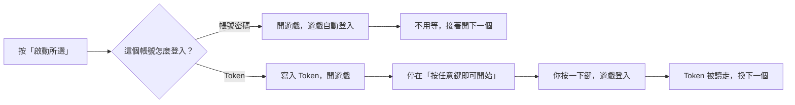
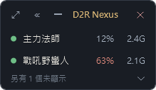

  

<h1 align="center">D2R Nexus · 暗黑中樞</h1>

《暗黑破壞神 II：獄火重生》多帳號啟動與管理工具（Windows）

<b>繁體中文</b> · <a href="README.zh-CN.md">简体中文</a> · <a href="README.en.md">English</a> · <a href="README.ko.md">한국어</a>

  
  

勾選要玩的帳號，按一下「啟動所選」，Nexus 會依序幫你開好每一個遊戲，並自動解除多開限制。有綁手機驗證器（OTP）的帳號也能用。

> 目前是開發測試版，部分情境仍在實機驗證中。

## ✨ 功能

**多開與登入**

- **一鍵多開** —— 勾選帳號，依你排的順序逐一開啟，自動解除多開限制
- **支援 OTP 驗證器** —— 手機核准一次，之後直接啟動
- **群組** —— 常一起玩的帳號一鍵勾選

**每個帳號可以各自設定**

- **登入地區、視窗模式、靜音、MOD、額外參數**
- **畫面與效能** —— 視窗解析度、幀數上限、CPU 優先順序。背景帳號鎖低幀、把優先順序設低，資源留給主力帳號
- **視窗改名** —— 遊戲標題改成帳號名稱，多開時不會認錯

**其他**

- **免安裝** —— 一個 exe，不用另外裝 .NET
- **畫面隱私** —— 帳號自動打碼；密碼與 Token 以 Windows 加密保存在本機
- **迷你視窗** —— 常駐小清單，一眼看出哪些開著，點一下切換或補開
- **快捷鍵** —— 每個帳號一組，按下直接切到那個遊戲
- **右下角圖示** —— 按關閉鈕可以選擇收到工作列右下角，程式繼續執行
- **多語系介面** —— 繁體中文、简体中文、English、한국어，左下角的地球圖示或上方「語言」選單就能切換
- **檢查新版本** —— 有新版會提示，不會自動下載或安裝，可關閉

## ⬇️ 下載

到 [Releases](https://github.com/MoroseDog/D2RNexus/releases) 下載 `D2RNexus.exe`，放在任意資料夾直接執行。[版本紀錄](CHANGELOG.md)

| 需求 | |
|---|---|
| 系統 | Windows 10 / 11（64 位元） |
| 遊戲 | 已安裝《暗黑破壞神 II：獄火重生》 |
| WebView2 | OTP 登入時需要，Windows 10 / 11 通常已內建 |
| 網路 | 登入 Battle.net；第一次多開時下載微軟官方工具；開啟時查詢新版本（可關閉） |

程式沒有購買程式碼簽章，所以會跳警告：Edge 下載時點「刪除」旁的 **∨** →「仍要保留」；執行時按「其他資訊」→「仍要執行」。原因見[安全性說明](SECURITY.md)；每個版本的 VirusTotal 掃描結果附在 Release 說明。

## 🚀 快速開始

1. 開啟 Nexus，Windows 詢問管理員權限時按「是」。
2. Nexus 會自動找到遊戲。活動紀錄沒有出現「已找到遊戲」的話，到左側「全域設定」按「自動尋找」，還是找不到就按「瀏覽遊戲執行檔…」選擇 `D2R.exe`。
3. 回到「帳號總覽」，修改示範帳號或按「＋ 新增帳號」，填入帳號、密碼、登入地區。
4. 有綁驗證器的帳號，勾「使用 Token 登入」，按「取得 Token」後在手機核准一次。
5. 勾選要開的帳號，按「啟動所選」。

拖曳帳號左側的 ≡ 調整啟動順序；亮起的「沿用全域」表示該項使用全域設定，點一下改成個別設定。

> 💡 多開時，把背景帳號的**幀數上限**調低、**CPU 優先順序**設成「低」，主力帳號會順一點。

### Token 帳號的啟動順序

Windows 一次只存得下一個 Token，所以兩個 Token 帳號不能同時開：**前一個沒有在遊戲視窗按鍵登入，後面的帳號就會一直等**（活動紀錄會寫出它在等誰、等了幾秒）。用帳號密碼登入的帳號會自己登入，不受影響。

### 迷你視窗

玩的時候把主視窗收成一條小清單，放在畫面角落：

綠點代表遊戲開著（點一下切過去），灰點代表沒開（點一下就啟動），橘點代表遊戲沒有回應（右鍵可以結束它）。旁邊是那個帳號用掉的 CPU 與記憶體。

帳號多的時候清單會很長：不想出現在這裡的帳號，在那一列按右鍵選「不要顯示在這裡」，或到帳號設定取消勾選「顯示在迷你視窗」。清單下方會寫還有幾個沒顯示、其中幾個正在跑，點旁邊的箭頭就能展開，點一下把帳號放回清單。被隱藏的帳號照常啟動，快捷鍵也照常用。

## 🛡️ 不是外掛

Nexus 只是幫你開遊戲的管理工具，**不注入程式、不讀寫遊戲記憶體、不改遊戲檔案、不攔截連線、不自動操作遊戲、不模擬鍵盤滑鼠、不繞過驗證、不上傳你的資料**。每一項做法、需要的權限和連線對象都寫在[安全性說明](SECURITY.md)。

多開與第三方工具是否符合規範，最終以 Blizzard 的使用條款與判定為準，Nexus 無法保證帳號不會受到任何處分。

## ❓ 常見問題

連線 Battle.net 顯示「無法認證」

遊戲已經開啟，是 Battle.net 拒絕登入，和多開無關。依序確認：

1. 帳號有綁驗證器 → 改用「使用 Token 登入」並取得 Token
2. 密碼是否正確（改過密碼要重新輸入）
3. 登入帳號（Email）有沒有打錯
4. 用 Token 的帳號，重綁過驗證器就按「清除」再重新取得
5. 先用 Battle.net 啟動器登入一次，完成安全驗證後再試

一直卡在「連接到 Battle.net」

遊戲已經開起來、多開也成功了，是登入時 Battle.net 沒有回應。依序試試：

1. 關掉遊戲，用 Battle.net 啟動器登入這個帳號一次，有「我不是機器人」之類的驗證就做完，等一段時間再開。短時間登入太多次或打錯密碼幾次，Battle.net 會要求驗證，用 Nexus 開的遊戲沒有地方做驗證，就可能一直卡著
2. 有開 VPN 或加速器，先關掉再試
3. 從 Battle.net 啟動器開遊戲也卡住，就是網路或伺服器的問題，和多開無關

還是不行請到 Issues 回報，附上登入方式（帳密或 Token）、是第幾個帳號開始卡，以及日誌。

亞洲可以玩，換歐洲或美洲就說無法連上伺服器

用帳號密碼登入時會這樣，那個帳號改用 Token 登入就正常（板友回報，亞洲不受影響）。

到帳號設定把「登入地區」改成歐洲或美洲，勾「使用 Token 登入」，再按「取得 Token」在手機核准一次。**Token 是分地區的**，換地區要重新取得；取得的 Token 和登入地區不同時，活動紀錄會提醒你。

用 Token 登入的帳號，進遊戲只能離線？

那個 Token 失效了。改過 Battle.net 密碼、重綁或停用驗證器都會讓它失效。

到帳號設定的「登入 Token」按「清除」，再按一次「取得 Token」，在手機重新核准。沒綁驗證器的帳號，也可以取消勾選「使用 Token 登入」，改用帳號密碼登入。

用 Token 登入的帳號，開起來停在「按任意鍵即可開始」

這是遊戲本身的行為：用 Token 啟動時，遊戲會先停在開場畫面，**在那個視窗按任意鍵**才會開始登入。用帳號密碼登入的帳號會自己登入，不用按。

有多個 Token 帳號時這一步更重要：Windows 一次只放得下一個 Token，**前一個帳號登入之後才輪得到下一個**。所以你沒去按的話，後面的帳號會一直等（活動紀錄會寫出它在等什麼、等了多久）。啟動後先把每個 Token 帳號的視窗按一下，後面就會接著開。

用 Apple、Google 等方式登入，沒有 Battle.net 密碼

取得 Token 的頁面只接受 Email 和密碼。請在登入視窗按右上角的「用其他方式登入」，用平常的方式登入後再按「完成登入」。步驟見[用 Apple、Google 等方式登入](docs/apple-login.md)。

Nexus 會改到我在遊戲裡調的設定嗎？

只會寫入你在「畫面與效能」設定的**視窗解析度**和**幀數上限**，其他遊戲設定（畫質、音量、自動地圖、按鍵…）完全不碰。遊戲的幀數限制取「幀數上限」和「動態解析度調節」的「目標幀數」裡較大的那個，所以目標幀數高於上限時，Nexus 會把它降到同一個數字。

那兩項由 Nexus 決定，所以在遊戲裡改了之後，下次啟動會被帳號的設定覆蓋。想把遊戲裡調好的值變成預設，到「全域設定 → 畫面與效能」按一次「讀取目前遊戲設定」。

幀數上限設了，實際幀數卻不一樣？

先看遊戲「顯示設定」的**垂直同步**。開著的時候，實際幀數只會落在螢幕更新率的整除值上：60Hz 的螢幕就是 60、30、20、15，所以設 36 或 45 實際會跑 30。想完全照數字跑就把垂直同步關掉。

另一個是「動態解析度調節」的**目標幀數**，遊戲會取它和幀數上限裡較大的那個。v0.4.3 起 Nexus 會在需要時把它一起降下來，更舊的版本請自己在遊戲裡確認那個值。

CPU 優先順序有什麼用？

多開時大家一起搶 CPU，把背景帳號設成「低」，主力帳號就會先用到 CPU，卡頓會少一點。

要注意它**不會讓 CPU 使用率變低**，只是決定誰先用。如果你開的數量不多、CPU 沒有吃滿，設了也不會有感覺，維持「正常」就好。

多開很卡，或是一次開太多開不起來？

Nexus 只負責把遊戲開起來，開起來之後不會佔用效能，卡頓是幾個遊戲一起跑造成的。背景掛著的帳號三項一起設才有感：

1. **幀數上限** 設 15 或 30
2. **CPU 優先順序** 設「低」，讓主力帳號先用到 CPU
3. **視窗解析度** 設 1280x720

一次開很多個時，前一個還在讀取就被下一個擠住的話，到「全域設定 → 啟動與診斷」把「各帳號啟動間隔」調成 5～10 秒。

快捷鍵會記錄我按了什麼嗎？

不會。Nexus 是向 Windows **註冊**你指定的組合鍵，只有你按下那一組時 Windows 才會通知它，其他按鍵完全收不到。這和會攔截所有按鍵的「鍵盤掛鉤」是兩回事，Nexus 沒有用後者。

也因為組合鍵是向系統註冊的，那一組在 Nexus 執行期間不會傳給其他程式，所以設定時一定要含 Ctrl、Alt 或 Win，不要用遊戲本身會用到的單鍵。

關掉視窗以後程式還在跑？

按關閉鈕時可以選「收到右下角」，Nexus 就會繼續在背景執行，點工作列右下角的圖示能叫回來，右鍵有「顯示主視窗 / 結束」。

這個選擇可以記住，之後想改到「全域設定 → 視窗 → 按關閉鈕時」。按最小化則和一般程式一樣，留在工作列。

為什麼需要管理員權限？

解除多開限制需要，開啟時只問一次。拒絕仍可使用，只是每次要再問。遊戲會跟著以管理員權限執行，OBS、Discord 可能也要用管理員身分開啟才能擷取畫面。

帳號密碼存在哪裡？

在你電腦的 `%LOCALAPPDATA%\D2RNexus`，密碼與 Token 以 Windows 內建加密保存，不會上傳。以帳號密碼登入時，密碼會傳給遊戲的啟動參數；Token 登入則不會。

顯示「視窗就緒」代表登入成功嗎？

不一定。Nexus 只能確認視窗出現，無法判斷是否登入完成，請以遊戲畫面為準。

視窗解析度可以設多小？

清單是遊戲支援的視窗大小，也可以選「自行輸入」。最小建議 1280x720，再小遊戲不會等比例縮小，而是直接裁掉畫面（物品欄、快捷列可能看不到）。

關掉 Nexus 會關掉遊戲嗎？

不會。重開 Nexus 後仍認得之前開的遊戲，不會讓同一個帳號重複開啟。

如何完全移除？

刪除 `D2RNexus.exe` 與資料夾 `%LOCALAPPDATA%\D2RNexus`。用過視窗解析度的話，遊戲設定資料夾裡的 `Settings.json.nexus-backup` 也可以刪。

## 🐛 回報問題

到 [Issues](https://github.com/MoroseDog/D2RNexus/issues) 描述狀況，並附上作業系統、遊戲版本、Nexus 版本、登入方式，以及日誌（上方選單「說明 → 開啟日誌資料夾」）。

Issues 是公開的，請不要貼出密碼、Token、完整 Email 或 BattleTag，截圖也請先遮住帳號。

## 📄 授權

Copyright © 2026 J.J. Huang，保留所有權利。可免費供個人使用；未經作者書面同意，不得修改、重新散布或販售。完整條款見 [LICENSE.txt](LICENSE.txt)，第三方元件授權見 [THIRD-PARTY-NOTICES.txt](THIRD-PARTY-NOTICES.txt)。

D2R Nexus 是非官方工具，與 Blizzard Entertainment 無關，也未獲其認可或支援。Diablo® II: Resurrected 與 Battle.net® 是 Blizzard Entertainment, Inc. 的商標或註冊商標。使用風險由使用者自行承擔。
