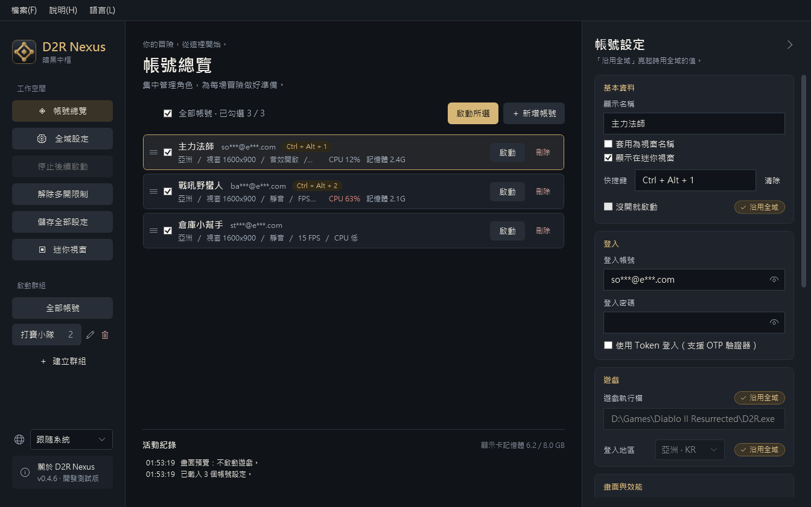
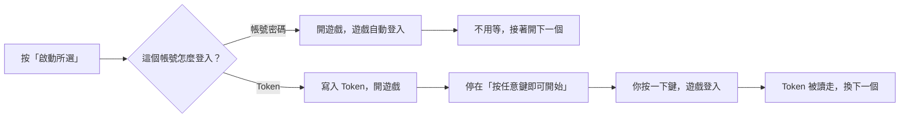
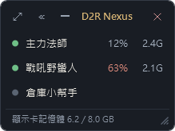

  

<h1 align="center">D2R Nexus · 暗黑中樞</h1>

《暗黑破壞神 II：獄火重生》多帳號啟動與管理工具（Windows）

<b>繁體中文</b> · <a href="README.zh-CN.md">简体中文</a> · <a href="README.en.md">English</a> · <a href="README.ko.md">한국어</a>

  
  

勾選要玩的帳號，按一下「啟動所選」，Nexus 會依序幫你開好每一個遊戲，並自動解除多開限制。有綁手機驗證器（OTP）的帳號也能用。

> 目前是開發測試版，部分情境仍在實機驗證中。

<h2 align="center">⚠️ v0.5.0 起，Nexus 會替你按下遊戲裡的按鍵</h2>

<b>預設關閉。要你自己開啟、看完說明並按下同意才會生效。 
開啟之後等於由程式替你操作遊戲，帳號風險由你自己承擔。</b>

<b>每個帳號還可以各自決定要不要用。 
想讓主帳號或倉庫號完全不碰這個功能，就讓那個帳號保持關閉。</b>

> [!IMPORTANT]
> **v0.5.0 的改變：Nexus 現在可以替你按下遊戲的開場畫面。**
>
> **v0.4.6 以前**，Nexus 不會對遊戲送出任何按鍵，這一點寫在說明裡。**v0.5.0 開始**多了「自動按掉開場畫面」，會替你按下「按任意鍵即可開始」。
>
> - 這個功能**預設是關閉的**。不開啟的話，Nexus 的行為和以前完全一樣，一個按鍵都不會送出。
> - 要用的話得自己到「全域設定 → 登入協助」開啟，程式會先把做了什麼說清楚，倒數五秒後你按下同意才會生效。
> - 開啟之後，等於由程式替你操作遊戲。**帳號風險由你自己承擔**，請先衡量再決定。
> - **帳號總覽每一列都會標出來。** 會被程式代按的帳號是**紅色的「開場畫面：自動」**，不會的是**綠色的「開場畫面：手動」**，不用點進設定就看得出哪幾個帳號正在用這個功能。全部帳號都沒開時，這個標示不會出現。
> - **每個帳號也有自己的開關。** 想讓主帳號或倉庫號完全不碰這個功能，就在那個帳號取消「沿用全域」並讓它保持關閉。帳號單獨開啟時一樣會問你一次。
>
> 做法、範圍與停止條件寫在[安全性說明](SECURITY.md)。

## ✨ 功能

**多開與登入**

- **一鍵多開** —— 勾選帳號，依你排的順序逐一開啟，自動解除多開限制
- **支援 OTP 驗證器** —— 手機核准一次，之後直接啟動
- **群組** —— 常一起玩的帳號一鍵勾選

**每個帳號可以各自設定**

- **登入地區、視窗模式、靜音、MOD、額外參數**
- **遊戲設定** —— 視窗解析度、幀數上限、CPU 優先順序，以及畫質與音效設定組。主帳號高畫質、倉庫號低畫質，各帳號分別套用
- **視窗改名** —— 遊戲標題改成帳號名稱，多開時不會認錯

**其他**

- **免安裝** —— 一個 exe，不用另外裝 .NET
- **畫面隱私** —— 帳號自動打碼；密碼與 Token 以 Windows 加密保存在本機
- **迷你視窗** —— 常駐小清單，一眼看出哪些開著，點一下切換或補開；可以拖邊調整大小
- **用量看得到** —— 執行中的帳號顯示 CPU 與記憶體，還有整張顯示卡的記憶體用量，多開前先看有沒有吃滿
- **快捷鍵** —— 每個帳號一組，按下直接切到那個遊戲
- **右下角圖示** —— 按關閉鈕可以選擇收到工作列右下角，程式繼續執行
- **多語系介面** —— 繁體中文、简体中文、English、한국어，左下角的地球圖示或上方「語言」選單就能切換
- **檢查新版本** —— 有新版會提示，不會自動下載或安裝，可關閉

## ⬇️ 下載

到 [Releases](https://github.com/MoroseDog/D2RNexus/releases) 下載 `D2RNexus.exe`，放在任意資料夾直接執行。[版本紀錄](CHANGELOG.md)

| 需求 | |
|---|---|
| 系統 | Windows 10 / 11（64 位元） |
| 遊戲 | 已安裝《暗黑破壞神 II：獄火重生》 |
| WebView2 | OTP 登入時需要，Windows 10 / 11 通常已內建 |
| 網路 | 登入 Battle.net；第一次多開時下載微軟官方工具；開啟時查詢新版本（可關閉） |

程式沒有購買程式碼簽章，所以會跳警告：Edge 下載時點「刪除」旁的 **∨** →「仍要保留」；執行時按「其他資訊」→「仍要執行」。原因見[安全性說明](SECURITY.md)；每個版本的 VirusTotal 掃描結果附在 Release 說明。

## 🚀 快速開始

1. 開啟 Nexus，Windows 詢問管理員權限時按「是」。
2. Nexus 會自動找到遊戲。活動紀錄沒有出現「已找到遊戲」的話，到左側「全域設定」按「自動尋找」，還是找不到就按「瀏覽遊戲執行檔…」選擇 `D2R.exe`。
3. 回到「帳號總覽」，修改示範帳號或按「＋ 新增帳號」，填入帳號、密碼、登入地區。
4. 有綁驗證器的帳號，勾「使用 Token 登入」，按「取得 Token」後在手機核准一次。
5. 勾選要開的帳號，按「啟動所選」。

拖曳帳號左側的 ≡ 調整啟動順序；亮起的「沿用全域」表示該項使用全域設定，點一下改成個別設定。

> 💡 多開時，把背景帳號的**幀數上限**調低、**CPU 優先順序**設成「低」，**畫質**換成低的設定組，主力帳號會順一點。

### Token 帳號的啟動順序

```mermaid
flowchart LR
    A["按「啟動所選」"] --> B{"這個帳號怎麼登入？"}
    B -->|帳號密碼| C["開遊戲，遊戲自動登入"]
    C --> D["不用等，接著開下一個"]
    B -->|Token| E["寫入 Token，開遊戲"]
    E --> F["停在「按任意鍵即可開始」"]
    F --> G["你按一下鍵，遊戲登入"]
    G --> H["Token 被讀走，換下一個"]
```

Windows 一次只存得下一個 Token，所以兩個 Token 帳號不能同時開：**前一個沒有在遊戲視窗按鍵登入，後面的帳號就會一直等**（活動紀錄會寫出它在等誰、等了幾秒）。用帳號密碼登入的帳號會自己登入，不受影響。

### 迷你視窗

玩的時候把主視窗收成一條小清單，放在畫面角落：

綠點代表遊戲開著（點一下切過去），灰點代表沒開（點一下就啟動），橘點代表遊戲沒有回應（右鍵可以結束它）。旁邊是那個帳號用掉的 CPU 與記憶體。

帳號多的時候清單會很長：不想出現在這裡的帳號，在那一列按右鍵選「不要顯示在這裡」，或到帳號設定取消勾選「顯示在迷你視窗」。清單下方會寫還有幾個沒顯示、其中幾個正在跑，點旁邊的箭頭就能展開，點一下把帳號放回清單。被隱藏的帳號照常啟動，快捷鍵也照常用。

開著的帳號會排在清單最前面，帳號多的時候不用捲到下面找；不想這樣的話，在面板上按右鍵取消「執行中的排在最前面」。視窗可以拖邊調整大小，清單放不下就會捲動。最下面一行是**整張顯示卡**的記憶體用量，收起成小條時顯示百分比，用掉九成以上會變色；帳號總覽的每一列也會顯示那個帳號用掉的 CPU 與記憶體。

## 🛡️ 不是外掛

Nexus 只是幫你開遊戲的管理工具，**不注入程式、不讀寫遊戲記憶體、不改遊戲檔案、不攔截連線、不掛機打怪撿物、不繞過驗證、不上傳你的資料**。每一項做法、需要的權限和連線對象都寫在[安全性說明](SECURITY.md)。

只有一個例外，**v0.5.0 才加的，而且預設是關閉的**：**自動按掉開場畫面**（v0.4.6 以前沒有這個功能，Nexus 不會送出任何按鍵）。用 Token 登入的遊戲會停在「按任意鍵即可開始」等人按一下，開啟後由 Nexus 送出一個空白鍵替你按掉，只送給 Nexus 自己啟動的那個遊戲視窗，登入完成就停。這是程式替你操作遊戲，所以開啟前會先跳出說明視窗、倒數五秒才能按同意，同意的時間與當時的內容會留在你自己的電腦上，不會上傳到任何地方。不開啟的話，Nexus 一個按鍵都不會送出，也不會記錄你按了什麼。

**而且這個開關是每個帳號各自獨立的。** 全域開啟之後，個別帳號仍然可以單獨關掉：把主帳號、倉庫號留在這個功能之外，真的出了什麼事，沒用過的帳號不會跟著一起。帳號單獨開啟時一樣要再同意一次。

多開與第三方工具是否符合規範，最終以 Blizzard 的使用條款與判定為準，Nexus 無法保證帳號不會受到任何處分；開啟自動按鍵等於自己多擔一份風險，請先衡量再決定。

## ❓ 常見問題

- **顯示「無法認證」** —— 帳號綁了驗證器就要改用 Token 登入；沒綁就檢查密碼與登入帳號有沒有打錯。
- **停在「按任意鍵即可開始」** —— 遊戲本來就這樣，要在那個視窗按一下才會開始登入，後面的 Token 帳號會等它。
- **更新版本，設定會不見嗎** —— 不會。更新只是把 exe 換掉，帳號與設定存在另一個資料夾。

其他問題（連線、遊戲設定、權限、移除…）整理在[常見問題](docs/faq.md)。

## 🐛 回報問題

到 [Issues](https://github.com/MoroseDog/D2RNexus/issues) 描述狀況，並附上作業系統、遊戲版本、Nexus 版本、登入方式，以及日誌（上方選單「說明 → 開啟日誌資料夾」）。

Issues 是公開的，請不要貼出密碼、Token、完整 Email 或 BattleTag，截圖也請先遮住帳號。

## 📄 授權

Copyright © 2026 J.J. Huang，保留所有權利。可免費供個人使用；未經作者書面同意，不得修改、重新散布或販售。完整條款見 [LICENSE.txt](LICENSE.txt)，第三方元件授權見 [THIRD-PARTY-NOTICES.txt](THIRD-PARTY-NOTICES.txt)。

D2R Nexus 是非官方工具，與 Blizzard Entertainment 無關，也未獲其認可或支援。Diablo® II: Resurrected 與 Battle.net® 是 Blizzard Entertainment, Inc. 的商標或註冊商標。使用風險由使用者自行承擔。
