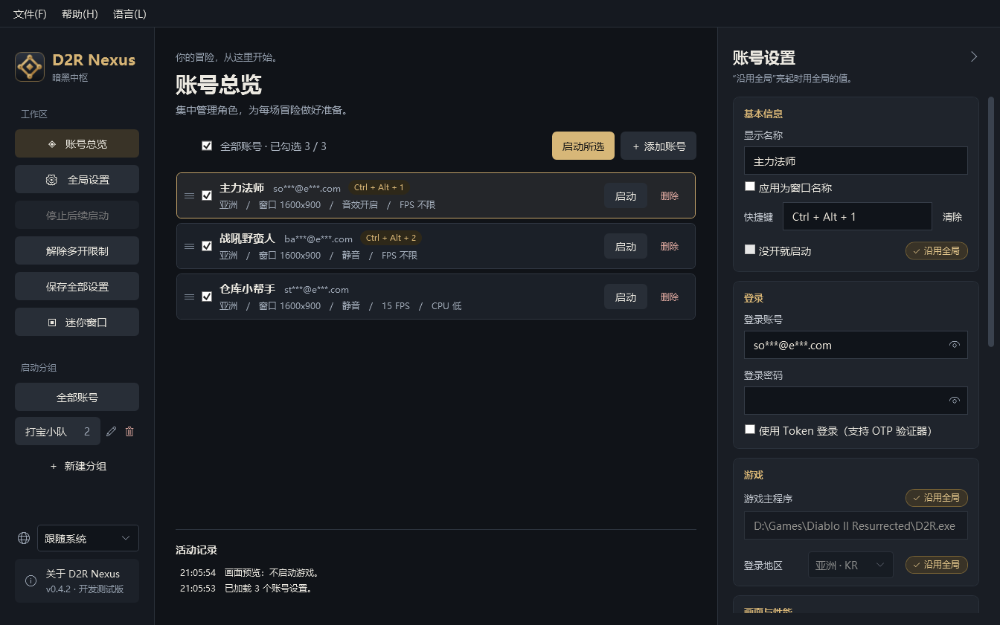
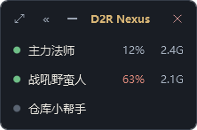

  

<h1 align="center">D2R Nexus · 暗黑中枢</h1>

《暗黑破坏神 II：狱火重生》多账号启动与管理工具（Windows）

<a href="README.md">繁體中文</a> · <b>简体中文</b> · <a href="README.en.md">English</a> · <a href="README.ko.md">한국어</a>

  
  

勾选要玩的账号，点击“启动所选”，Nexus 会依次帮你打开每一个游戏，并自动解除多开限制。绑定了手机验证器（OTP）的账号也能用。

> 目前是开发测试版，部分场景仍在实机验证中。

## ✨ 功能

**多开与登录**

- **一键多开** —— 勾选账号，按你排好的顺序逐个打开，自动解除多开限制
- **支持 OTP 验证器** —— 在手机上批准一次，之后直接启动
- **分组** —— 常一起玩的账号一键勾选

**每个账号可以单独设置**

- **登录地区、窗口模式、静音、MOD、额外参数**
- **画面与性能** —— 窗口分辨率、帧率上限、CPU 优先级。后台账号锁低帧率、把优先级设低，资源留给主力账号
- **窗口改名** —— 游戏标题改成账号名称，多开时不会认错

**其他**

- **免安装** —— 一个 exe，不用另外装 .NET
- **屏幕隐私** —— 账号自动打码；密码与 Token 用 Windows 加密保存在本机
- **迷你窗口** —— 常驻的小列表，一眼看出哪些开着，点一下切换或补开
- **快捷键** —— 每个账号一组，按下直接切到那个游戏
- **右下角图标** —— 点击关闭时可以选择收到任务栏右下角的通知区域，程序继续运行
- **多语言界面** —— 繁體中文、简体中文、English、한국어，点击左下角的地球图标或顶部的“语言”菜单就能切换
- **检查新版本** —— 有新版会提示，不会自动下载或安装，可关闭

## ⬇️ 下载

到 [Releases](https://github.com/MoroseDog/D2RNexus/releases) 下载 `D2RNexus.exe`，放在任意文件夹里直接运行。[版本记录](CHANGELOG.zh-CN.md)

| 需求 | |
|---|---|
| 系统 | Windows 10 / 11（64 位） |
| 游戏 | 已安装《暗黑破坏神 II：狱火重生》 |
| WebView2 | OTP 登录时需要，Windows 10 / 11 通常已内置 |
| 网络 | 登录 Battle.net；第一次多开时下载微软官方工具；打开时查询新版本（可关闭） |

程序没有购买数字签名证书，所以会弹出警告：Edge 下载时点击“删除”旁的 **∨** →“仍然保留”；运行时点击“更多信息”→“仍要运行”。原因见[安全说明](SECURITY.zh-CN.md)；每个版本的 VirusTotal 扫描结果附在 Release 说明里。

## 🚀 快速开始

1. 打开 Nexus，Windows 请求管理员权限时点击“是”。
2. Nexus 会自动找到游戏。活动记录里没有出现“已找到游戏”的话，到左侧“全局设置”点击“自动查找”，还是找不到就点击“浏览游戏主程序…”选择 `D2R.exe`。
3. 回到“账号总览”，修改示例账号或点击“＋ 添加账号”，填入账号、密码、登录地区。
4. 绑定了验证器的账号，勾选“使用 Token 登录”，点击“获取 Token”后在手机上批准一次。
5. 勾选要打开的账号，点击“启动所选”。

拖动账号左侧的 ≡ 调整启动顺序；亮起的“沿用全局”表示该项使用全局设置，点一下改成这个账号单独的设置。

> 💡 多开时，把后台账号的**帧率上限**调低、**CPU 优先级**设成“低”，主力账号会流畅一点。

### 迷你窗口

玩的时候把主窗口收成一条小列表，放在屏幕角落：

绿点表示游戏开着（点一下切过去），灰点表示没开（点一下就启动），橙点表示游戏没有响应（右键可以结束它）。旁边是这个账号占用的 CPU 与内存。

## 🛡️ 不是外挂

Nexus 只是帮你打开游戏的管理工具，**不注入程序、不读写游戏内存、不修改游戏文件、不拦截网络连接、不自动操作游戏、不模拟键盘鼠标、不绕过验证、不上传你的数据**。每一项做法、需要的权限和连接对象都写在[安全说明](SECURITY.zh-CN.md)里。

多开与第三方工具是否符合规定，最终以 Blizzard 的使用条款与判定为准，Nexus 无法保证账号不会受到任何处罚。

## ❓ 常见问题

连接 Battle.net 时显示“无法验证”

游戏已经打开，是 Battle.net 拒绝登录，和多开无关。请依次确认：

1. 账号绑定了验证器 → 改用“使用 Token 登录”并获取 Token
2. 密码是否正确（改过密码要重新输入）
3. 登录账号（Email）有没有输错
4. 使用 Token 的账号，重新绑定过验证器的话，点击“清除”再重新获取
5. 先用 Battle.net 启动器登录一次，完成安全验证后再试

一直卡在“连接到 Battle.net”

游戏已经打开、多开也成功了，是登录时 Battle.net 没有响应。请依次试试：

1. 关掉游戏，用 Battle.net 启动器登录这个账号一次，有“我不是机器人”之类的验证就做完，等一段时间再打开。短时间内登录太多次或输错几次密码，Battle.net 会要求验证，而用 Nexus 打开的游戏没有地方做验证，就可能一直卡着
2. 开了 VPN 或加速器的话，先关掉再试
3. 从 Battle.net 启动器打开游戏也卡住，就是网络或服务器的问题，和多开无关

还是不行的话，请到 Issues 反馈，附上登录方式（账号密码或 Token）、从第几个账号开始卡住，以及日志。

用 Apple、Google 等方式登录，没有 Battle.net 密码

获取 Token 的页面只接受 Email 和密码。请在登录窗口点击右上角的“用其他方式登录”，用平时的方式登录后再点击“完成登录”。步骤见[用 Apple、Google 等方式登录（繁体中文）](docs/apple-login.md)。

Nexus 会改动我在游戏里调好的设置吗？

只会写入你在“画面与性能”里设置的**窗口分辨率**和**帧率上限**，其他游戏设置（画质、音量、自动地图、按键…）完全不碰。

这两项由 Nexus 决定，所以在游戏里改了之后，下次启动会被账号的设置覆盖。想把游戏里调好的值作为默认值，到“全局设置 → 画面与性能”点击一次“读取当前游戏设置”。

CPU 优先级有什么用？

多开时大家一起抢 CPU，把后台账号设成“低”，主力账号就会先用到 CPU，卡顿会少一点。

要注意它**不会让 CPU 使用率变低**，只是决定谁先用。如果你开的数量不多、CPU 没有占满，设了也感觉不到差别，保持“正常”就好。

快捷键会记录我按了什么吗？

不会。Nexus 是向 Windows **注册**你指定的组合键，只有你按下那一组时 Windows 才会通知它，其他按键完全收不到。这和会拦截所有按键的“键盘钩子”是两回事，Nexus 没有使用后者。

也正因为组合键是向系统注册的，这一组在 Nexus 运行期间不会传给其他程序，所以设置时一定要包含 Ctrl、Alt 或 Win，不要用游戏本身会用到的单键。

关掉窗口以后程序还在运行？

点击关闭时可以选“收到右下角”，Nexus 就会继续在后台运行，点击任务栏右下角的图标能调出来，右键菜单里有“显示主窗口 / 退出”。

这个选择可以记住，之后想改，到“全局设置 → 窗口 → 点击关闭时”。点最小化则和一般程序一样，留在任务栏上。

为什么需要管理员权限？

解除多开限制需要，打开时只问一次。拒绝也能使用，只是每次都要再问。游戏会随之以管理员权限运行，OBS、Discord 可能也要以管理员身份运行才能捕获画面。

账号密码保存在哪里？

在你电脑上的 `%LOCALAPPDATA%\D2RNexus`，密码与 Token 用 Windows 内置加密保存，不会上传。用账号密码登录时，密码会传给游戏的启动参数；Token 登录则不会。

显示“窗口就绪”代表登录成功吗？

不一定。Nexus 只能确认窗口出现，无法判断是否登录完成，请以游戏画面为准。

窗口分辨率最小可以设多少？

列表里是游戏支持的窗口大小，也可以选“自定义”。建议最小 1280x720，再小的话游戏不会等比例缩小，而是直接裁掉画面（物品栏、快捷栏可能看不到）。

关掉 Nexus 会关掉游戏吗？

不会。重新打开 Nexus 后仍能认出之前打开的游戏，不会让同一个账号重复启动。

如何彻底移除？

删除 `D2RNexus.exe` 与文件夹 `%LOCALAPPDATA%\D2RNexus`。用过窗口分辨率设置的话，游戏设置文件夹里的 `Settings.json.nexus-backup` 也可以删除。

## 🐛 反馈问题

到 [Issues](https://github.com/MoroseDog/D2RNexus/issues) 描述情况，并附上操作系统、游戏版本、Nexus 版本、登录方式，以及日志（顶部菜单“帮助 → 打开日志文件夹”）。

Issues 是公开的，请不要贴出密码、Token、完整 Email 或 BattleTag，截图也请先遮住账号。

## 📄 授权

Copyright © 2026 J.J. Huang，保留所有权利。可免费供个人使用；未经作者书面同意，不得修改、重新分发或出售。完整条款见 [LICENSE.txt](LICENSE.txt)，第三方组件授权见 [THIRD-PARTY-NOTICES.txt](THIRD-PARTY-NOTICES.txt)。

D2R Nexus 是非官方工具，与 Blizzard Entertainment 无关，也未获其认可或支持。Diablo® II: Resurrected 与 Battle.net® 是 Blizzard Entertainment, Inc. 的商标或注册商标。使用风险由用户自行承担。
