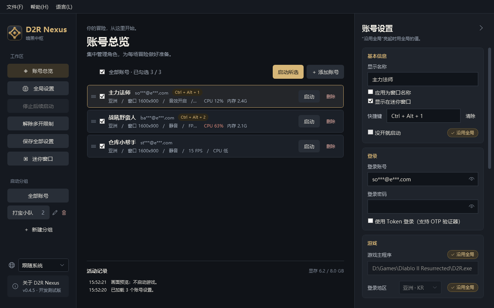
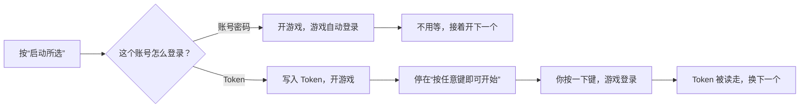
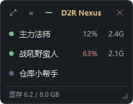

  

<h1 align="center">D2R Nexus · 暗黑中枢</h1>

《暗黑破坏神 II：狱火重生》多账号启动与管理工具（Windows）

<a href="README.md">繁體中文</a> · <b>简体中文</b> · <a href="README.en.md">English</a> · <a href="README.ko.md">한국어</a>

  
  

勾选要玩的账号，点击“启动所选”，Nexus 会依次帮你打开每一个游戏，并自动解除多开限制。绑定了手机验证器（OTP）的账号也能用。

> 目前是开发测试版，部分场景仍在实机验证中。

<h2 align="center">⚠️ v0.5.0 起，Nexus 会替你按下游戏里的按键</h2>

<b>默认关闭。要你自己开启、看完说明并按下同意才会生效。 
开启之后等于由程序替你操作游戏，账号风险由你自己承担。</b>

<b>每个账号还可以各自决定要不要用。 
想让主账号或仓库号完全不碰这个功能，就让那个账号保持关闭。</b>

> [!IMPORTANT]
> **v0.5.0 的改变：Nexus 现在可以替你按下游戏的开场画面。**
>
> **v0.4.6 以前**，Nexus 不会对游戏送出任何按键，这一点写在说明里。**v0.5.0 开始**多了“自动按掉开场画面”，会替你按下“按任意键即可开始”。
>
> - 这个功能**默认是关闭的**。不开启的话，Nexus 的行为和以前完全一样，一个按键都不会送出。
> - 要用的话得自己到“全局设置 → 登录协助”开启，程序会先把做了什么说清楚，倒数五秒后你按下同意才会生效。
> - 开启之后，等于由程序替你操作游戏。**账号风险由你自己承担**，请先衡量再决定。
> - **账号总览每一列都会标出来。** 会被程序代按的账号是**红色的“开场画面：自动”**，不会的是**绿色的“开场画面：手动”**，不用点进设置就看得出哪几个账号正在用这个功能。全部账号都没开时，这个标示不会出现。
> - **每个账号也有自己的开关。** 想让主账号或仓库号完全不碰这个功能，就在那个账号取消“沿用全局”并让它保持关闭。账号单独开启时一样会问你一次。
>
> 做法、范围与停止条件写在[安全说明](SECURITY.zh-CN.md)。

## ✨ 功能

**多开与登录**

- **一键多开** —— 勾选账号，按你排好的顺序逐个打开，自动解除多开限制
- **支持 OTP 验证器** —— 在手机上批准一次，之后直接启动
- **分组** —— 常一起玩的账号一键勾选

**每个账号可以单独设置**

- **登录地区、窗口模式、静音、MOD、额外参数**
- **游戏设置** —— 窗口分辨率、帧率上限、CPU 优先级，以及画质与音效设置组。主账号高画质、仓库号低画质，各账号分别套用
- **多开时固定游戏选项** —— 游戏选项只有一份文件，多开时会互相覆盖；开启后每个账号都套用同一份，在某个账号改的设置不会被别的洗掉（默认关闭）
- **窗口改名** —— 游戏标题改成账号名称，多开时不会认错

**其他**

- **免安装** —— 一个 exe，不用另外装 .NET
- **屏幕隐私** —— 账号自动打码；密码与 Token 用 Windows 加密保存在本机
- **迷你窗口** —— 常驻的小列表，一眼看出哪些开着，点一下切换或补开；可以拖边调整大小
- **用量看得到** —— 运行中的账号显示 CPU 与内存，还有整张显卡的显存用量，多开前先看有没有吃满
- **快捷键** —— 每个账号一组，按下直接切到那个游戏
- **右下角图标** —— 点击关闭时可以选择收到任务栏右下角的通知区域，程序继续运行
- **多语言界面** —— 繁體中文、简体中文、English、한국어，点击左下角的地球图标或顶部的“语言”菜单就能切换
- **检查新版本** —— 有新版会提示，不会自动下载或安装，可关闭

## ⬇️ 下载

到 [Releases](https://github.com/MoroseDog/D2RNexus/releases) 下载 `D2RNexus.exe`，放在任意文件夹里直接运行。[版本记录](CHANGELOG.zh-CN.md)

| 需求 | |
|---|---|
| 系统 | Windows 10 / 11（64 位） |
| 游戏 | 已安装《暗黑破坏神 II：狱火重生》 |
| WebView2 | OTP 登录时需要，Windows 10 / 11 通常已内置 |
| 网络 | 登录 Battle.net；第一次多开时下载微软官方工具；打开时查询新版本（可关闭） |

程序没有购买数字签名证书，所以会弹出警告：Edge 下载时点击“删除”旁的 **∨** →“仍然保留”；运行时点击“更多信息”→“仍要运行”。原因见[安全说明](SECURITY.zh-CN.md)；每个版本的 VirusTotal 扫描结果附在 Release 说明里。

## 🚀 快速开始

1. 打开 Nexus，Windows 请求管理员权限时点击“是”。
2. Nexus 会自动找到游戏。活动记录里没有出现“已找到游戏”的话，到左侧“全局设置”点击“自动查找”，还是找不到就点击“浏览游戏主程序…”选择 `D2R.exe`。
3. 回到“账号总览”，修改示例账号或点击“＋ 添加账号”，填入账号、密码、登录地区。
4. 绑定了验证器的账号，勾选“使用 Token 登录”，点击“获取 Token”后在手机上批准一次。
5. 勾选要打开的账号，点击“启动所选”。

拖动账号左侧的 ≡ 调整启动顺序；亮起的“沿用全局”表示该项使用全局设置，点一下改成这个账号单独的设置。

> 💡 多开时，把后台账号的**帧率上限**调低、**CPU 优先级**设成“低”、**画质**换成低的设置组，主力账号会流畅一点。

### Token 账号的启动顺序

```mermaid
flowchart LR
    A["按“启动所选”"] --> B{"这个账号怎么登录？"}
    B -->|账号密码| C["开游戏，游戏自动登录"]
    C --> D["不用等，接着开下一个"]
    B -->|Token| E["写入 Token，开游戏"]
    E --> F["停在“按任意键即可开始”"]
    F --> G["你按一下键，游戏登录"]
    G --> H["Token 被读走，换下一个"]
```

Windows 一次只存得下一个 Token，所以两个 Token 账号不能同时开：**前一个没有在游戏窗口按键登录，后面的账号就会一直等**（活动记录会写出它在等谁、等了几秒）。用账号密码登录的账号会自己登录，不受影响。

### 迷你窗口

玩的时候把主窗口收成一条小列表，放在屏幕角落：

绿点表示游戏开着（点一下切过去），灰点表示没开（点一下就启动），橙点表示游戏没有响应（右键可以结束它）。旁边是这个账号占用的 CPU 与内存。

账号多的时候列表会很长：不想出现在这里的账号，在那一行按右键选“不要显示在这里”，或到账号设置取消勾选“显示在迷你窗口”。列表下方会写还有几个没显示、其中几个正在跑，点旁边的箭头就能展开，点一下把账号放回列表。被隐藏的账号照常启动，快捷键也照常用。

开着的账号会排在列表最前面，账号多的时候不用滚到下面找；不想这样的话，在面板上按右键取消“运行中的排在最前面”。窗口可以拖边调整大小，列表放不下就会滚动。最下面一行是**整张显卡**的显存用量，收起成小条时显示百分比，用掉九成以上会变色；账号总览的每一行也会显示那个账号占用的 CPU 与内存。

## 🛡️ 不是外挂

Nexus 只是帮你打开游戏的管理工具，**不注入程序、不读写游戏内存、不修改游戏文件、不拦截网络连接、不挂机打怪捡物、不绕过验证、不上传你的数据**。每一项做法、需要的权限和连接对象都写在[安全说明](SECURITY.zh-CN.md)里。

只有一个例外，**v0.5.0 才加的，而且默认是关闭的**：**自动按掉开场画面**（v0.4.6 以前没有这个功能，Nexus 不会送出任何按键）。用 Token 登录的游戏会停在“按任意键即可开始”等人按一下，开启后由 Nexus 送出一个空格键替你按掉，只送给 Nexus 自己启动的那个游戏窗口，登录完成就停。这是程序替你操作游戏，所以开启前会先弹出说明窗口、倒数五秒才能按同意，同意的时间与当时的内容会留在你自己的电脑上，不会上传到任何地方。不开启的话，Nexus 一个按键都不会送出，也不会记录你按了什么。

**而且这个开关是每个账号各自独立的。** 全局开启之后，个别账号仍然可以单独关掉：把主账号、仓库号留在这个功能之外，真的出了什么事，没用过的账号不会跟着一起。账号单独开启时一样要再同意一次。

多开与第三方工具是否符合规定，最终以 Blizzard 的使用条款与判定为准，Nexus 无法保证账号不会受到任何处罚；开启自动按键等于自己多担一份风险，请先衡量再决定。

## ❓ 常见问题

- **显示「无法认证」** —— 账号绑了验证器就要改用 Token 登录；没绑就检查密码与登录账号有没有打错。
- **停在「按任意键即可开始」** —— 游戏本来就这样，要在那个窗口按一下才会开始登录，后面的 Token 账号会等它。
- **更新版本，设置会不见吗** —— 不会。更新只是把 exe 换掉，账号与设置存在另一个文件夹。

其他问题（连接、游戏设置、权限、移除…）整理在[常见问题](docs/faq.zh-CN.md)。

## 🐛 反馈问题

到 [Issues](https://github.com/MoroseDog/D2RNexus/issues) 描述情况，并附上操作系统、游戏版本、Nexus 版本、登录方式，以及日志（顶部菜单“帮助 → 打开日志文件夹”）。

Issues 是公开的，请不要贴出密码、Token、完整 Email 或 BattleTag，截图也请先遮住账号。

## 📄 授权

Copyright © 2026 J.J. Huang，保留所有权利。可免费供个人使用；未经作者书面同意，不得修改、重新分发或出售。完整条款见 [LICENSE.txt](LICENSE.txt)，第三方组件授权见 [THIRD-PARTY-NOTICES.txt](THIRD-PARTY-NOTICES.txt)。

D2R Nexus 是非官方工具，与 Blizzard Entertainment 无关，也未获其认可或支持。Diablo® II: Resurrected 与 Battle.net® 是 Blizzard Entertainment, Inc. 的商标或注册商标。使用风险由用户自行承担。
