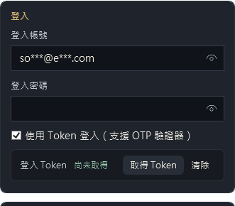
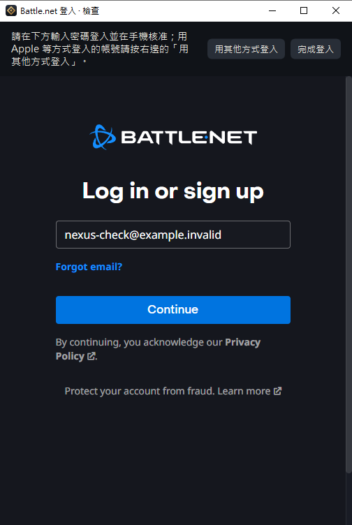

# 用 Apple、Google 等方式登入

如果你的 Battle.net 帳號是用 Apple、Google、Discord 這類方式登入，沒有設定過 Battle.net 密碼，請照這一頁操作。

**為什麼要多這幾步**：Nexus 取得登入 Token 的那一頁是 Battle.net 專門給遊戲用的登入頁，上面只有 Email 和密碼欄位，沒有 Apple 這些按鈕。那些按鈕只出現在 Battle.net 的一般登入頁，所以要先切過去登入，再回來取得 Token。

需要 D2R Nexus v0.2.2 以上。

## 步驟

**1. 帳號設定勾「使用 Token 登入」**

點選帳號，在右側的「登入」區塊勾選「使用 Token 登入（支援 OTP 驗證器）」。密碼欄位留空沒關係。

**2. 按「取得 Token」**

會跳出 Battle.net 登入視窗。

**3. 按右上角的「用其他方式登入」**

視窗會切換到 Battle.net 的一般登入頁，上面就有 Apple、Google、Discord、Xbox、Nintendo、Steam 等按鈕。

**4. 用你平常的方式登入**

點 Apple（或其他你用的方式），照畫面完成驗證。這一段全部是 Battle.net 和 Apple 的官方頁面，Nexus 不會填入任何東西，也看不到你的 Apple 密碼。

**5. 登入成功後，按右上角的「完成登入」**

視窗會回到取得 Token 的頁面。因為剛剛已經登入過，通常不會再要求輸入帳號密碼，Token 拿到後視窗會自動關閉。

**6. 之後直接啟動**

Token 會加密保存在你的電腦，下次啟動這個帳號不用再登入一次。

## 遇到狀況時

| 狀況 | 可以試試 |
|---|---|
| 按「完成登入」後又要求輸入帳號密碼 | 表示登入狀態沒有被帶過去。再按一次「用其他方式登入」重新登入，確定看到已登入的畫面再按「完成登入」 |
| 登入視窗一片空白或按鈕沒反應 | 關掉視窗重開一次；仍然不行請到 [Issues](https://github.com/MoroseDog/D2RNexus/issues) 回報 |
| Token 之後失效 | 在帳號設定按「清除」，再重新取得一次 |

## 另一個選擇

你也可以到 Battle.net 帳號設定，用「忘記密碼」流程替帳號設定一組密碼。設定好之後，就能和一般帳號一樣使用，不必每次切換登入頁。能不能這樣設定要看帳號狀況，必要時請洽暴雪客服。

## 附註

這個流程還沒有人實際用 Apple 帳號驗證過。試過之後，不論成功或失敗，都歡迎到 [Issues](https://github.com/MoroseDog/D2RNexus/issues) 或巴哈的討論串告訴我，我再調整。
